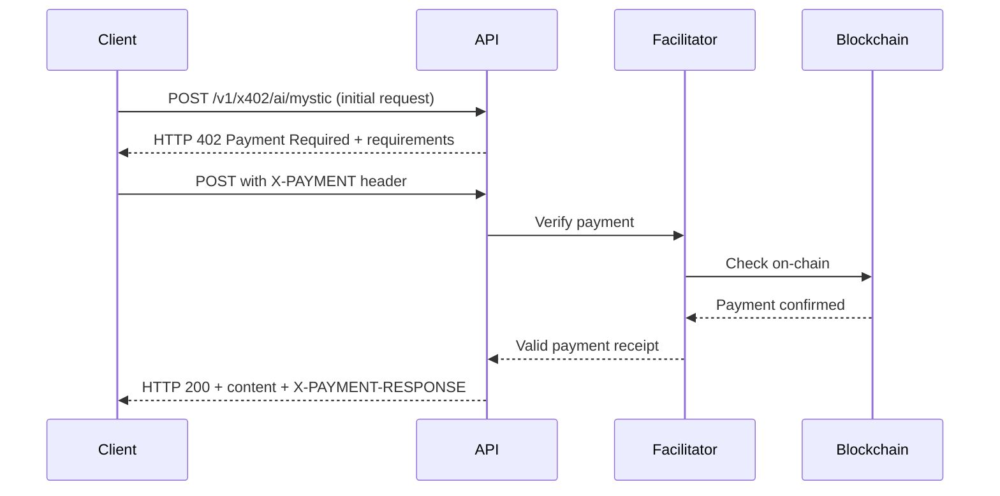

# Analyzes an image to determine its likelihood of being AI-generated
Source: https://docs.freepik.com/api-reference/classifier/post-ai-classifier

post /v1/ai/classifier/image
Accepts an image file as input and analyzes it to determine the probability that the image was generated by artificial intelligence, providing a confidence score.


# AI Icon generation
Source: https://docs.freepik.com/api-reference/icon-generation/post-generate-icon

post /v1/ai/text-to-icon
Create stunning icons in different styles and formats (png, svg) from text prompts using our advanced AI models.

## Description

Generate an icon from a text prompt.


# AI Icon preview generation
Source: https://docs.freepik.com/api-reference/icon-generation/post-preview

post /v1/ai/text-to-icon/preview
Create stunning previews icons in different styles and formats (png, svg) from text prompts using our advanced AI models.


# Download an icon preview
Source: https://docs.freepik.com/api-reference/icon-generation/post-{format}-by-id

post /v1/ai/text-to-icon/{task-id}/render/{format}
Download the generated AI icon in the specified format png or svg.


# Download an icon
Source: https://docs.freepik.com/api-reference/icons/download-an-icon

get /v1/icons/{id}/download
Download the specified icon by its unique ID in the requested format and size.

Download the original icon asset. See the [Icons API overview](/api-reference/icons/icons-api) for authentication and usage guidance.


# Search and filter icons by specified order
Source: https://docs.freepik.com/api-reference/icons/get-all-icons-by-order

get /v1/icons
Get a list of icons based on the provided parameters and ordering criteria.

Use the Freepik Icons API to list icons ordered by relevance, popularity, or recency. See the [Icons API overview](/api-reference/icons/icons-api) for authentication and usage guidance.


# Get detailed icon information by ID
Source: https://docs.freepik.com/api-reference/icons/get-one-icon-by-id

get /v1/icons/{id}
Get detailed information about a specific icon identified by its unique ID.

Fetch a specific icon by ID. See the [Icons API overview](/api-reference/icons/icons-api) for authentication and usage guidance.


# Icons API
Source: https://docs.freepik.com/api-reference/icons/icons-api

Search, retrieve, and download icons programmatically with the Freepik Icons API.

The Freepik Icons API lets you find and retrieve icons from our catalog with AI-powered search and download the assets for use in your applications.

### What you can do

* List icons with sorting and filters
* Get a single icon by ID
* Download an icon asset

### Authentication

All requests require an API key via the `x-freepik-api-key` header. See the [Quickstart](/quickstart) and [Authentication](/authentication).

### Endpoints

<div className="my-11">
  <Columns cols={2}>
    <Card title="GET /v1/icons" icon="code" href="/api-reference/icons/get-all-icons-by-order">
      List icons with sorting and filters
    </Card>

    <Card title="GET /v1/icons/{id}" icon="code" href="/api-reference/icons/get-one-icon-by-id">
      Retrieve a single icon by ID
    </Card>

    <Card title="GET /v1/icons/{id}/download" icon="code" href="/api-reference/icons/download-an-icon">
      Download an icon asset
    </Card>
  </Columns>
</div>

### Use cases

* Build an icon picker into your design tool or CMS
* AI-powered search by keyword and sort by popularity
* Programmatically download icons during build/deploy

### FAQ

#### Is there a rate limit?

Yes. See [Rate limits](/ratelimits).

#### What license applies to icons?

Refer to the [License agreement](https://www.freepik.com/legal/terms-of-use#api-services).


# Get the status of all image expand tasks
Source: https://docs.freepik.com/api-reference/image-expand/get-flux-pro

get /v1/ai/image-expand/flux-pro


# Get the status of one image expand task
Source: https://docs.freepik.com/api-reference/image-expand/get-{task-id}-by-id

get /v1/ai/image-expand/flux-pro/{task-id}


# Image expand using AI Flux Pro
Source: https://docs.freepik.com/api-reference/image-expand/post-flux-pro

post /v1/ai/image-expand/flux-pro
This endpoint allows you to expand an image using the AI Flux Pro model. The image will be expanded based on the provided parameters.


# Get the status of the relight task
Source: https://docs.freepik.com/api-reference/image-relight/get-image-relight

get /v1/ai/image-relight/{task-id}
Get the status of the relight task


# Get the status of all relight tasks
Source: https://docs.freepik.com/api-reference/image-relight/get-image-relight-task

get /v1/ai/image-relight
Get the status of all relight tasks


# Overview
Source: https://docs.freepik.com/api-reference/image-relight/image-relight


<Frame caption="Relight examples (from top left to bottom right): Original image, Night scene, Snowy landscape, and Hell scene.">
  <div className="grid grid-cols-1 md:grid-cols-2 gap-2">
    

    

    

    
  </div>
</Frame>

<div className="my-11">
  <Card title="Freepik API uses Magnific.ai technology, now available as a comprehensive API service." icon="circle-exclamation" />
</div>

Image Relight allows you to change the entire lighting of a scene and, optionally, the background using:

1. A prompt
2. A reference image
3. A light map

This tool can simulate different lighting scenarios, enhance details, and create artistic effects. Our API lets you transform your images with custom prompts and fine-tuned parameters for impressive results.

Image Relight uses Magnific.ai technology, now available as a comprehensive API service.

### Use Cases

The Image Relight can be applied to a wide range of image types and industries, including:

* Portraits: Change lighting to enhance facial features
* Product photography: Adjust lighting for better presentation
* Architectural renderings: Simulate different times of day
* Film stills: Create dramatic lighting effects
* Graphic design: Add creative lighting to designs
* Nature photography: Enhance natural light conditions

### Selecting Light Transfer Method

Choose one of these three ways to transfer light in Image Relight:

1. **Prompt** Describe the desired lighting using text. Specify characteristics like color, time of day, type and shape of light.
   Example: "A sunlit forest clearing at golden hour" or "Under the water"

2. **Reference Image** Provide an image to transfer lighting from. Image Relight will replicate the light, colors, and shadows from this reference.

3. **Lightmap** Create custom lighting with your own lightmap image:
   * Black represents absence of light
   * Lighter colors (including white) indicate presence, color, and shape of light sources

<div className="my-11">
  <Columns>
    <Card title="POST /v1/ai/image-relight" icon="wand-magic-sparkles" href="/api-reference/image-relight/post-image-relight">
      Relight an image using AI
    </Card>

    <Card title="GET /v1/ai/image-relight/{task-id}" icon="code" href="/api-reference/image-relight/get-image-relight">
      Get the status of a relighting task
    </Card>

    <Card title="GET /v1/ai/image-relight" icon="code" href="/api-reference/image-relight/get-image-relight-task">
      Get the status of all relighting tasks
    </Card>
  </Columns>
</div>

### Frequently Asked Questions

<AccordionGroup>
  <Accordion title="Is this the same technology as Magnific.ai?">
    Yes! Magnific.ai is part of Freepik and we are happy to offer the same technology in an API service. If you tried Magnific.ai before, you will get the same technology and its future updates.
  </Accordion>

  <Accordion title="How much does the image relight cost?">
    The cost per image relight is a fixed cost of €0.10 per operation. This ensures that you have complete transparency and control over your usage.
  </Accordion>
</AccordionGroup>


# Relight an image
Source: https://docs.freepik.com/api-reference/image-relight/post-image-relight

post /v1/ai/image-relight
Relight an image using AI. This endpoint accepts a variety of parameters to customize the generated images.

## Important

Upscaler endpoints are only available for premium API users. You can upgrade your account [here](https://www.freepik.com/developers/dashboard/billing).

## Request


# Get the status of all Style Transfer tasks
Source: https://docs.freepik.com/api-reference/image-style-transfer/get-image-style-transfer

get /v1/ai/image-style-transfer
Get the status of all Style Transfer tasks


# Get the status of the Style Transfer task
Source: https://docs.freepik.com/api-reference/image-style-transfer/get-image-style-transfer-task

get /v1/ai/image-style-transfer/{task-id}
Get the status of the Style Transfer task


# Overview
Source: https://docs.freepik.com/api-reference/image-style-transfer/image-styletransfer


<Frame caption="Style transfer examples (from left top to right bottom): Original image, then apply black and white, wild nature, wood and brick styles via prompts.">
  <div className="grid grid-cols-1 md:grid-cols-2 gap-2">
    

    

    

    
  </div>
</Frame>

<div className="my-11">
  <Card title="Freepik API uses Magnific.ai technology, now available as a comprehensive API service." icon="circle-exclamation" />
</div>

Image Style Transfer is a powerful AI-driven tool that allows you to transform any image by applying various artistic styles. This technology goes beyond simple filters, enabling you to control the amount of style transferred and maintain structural integrity. With our API, you can:

1. Apply predefined artistic styles
2. Use custom images as style references
3. Fine-tune the style transfer process with advanced parameters
4. Transform images while preserving important details
5. Combine style transfer with upscaling for high-resolution results

Whether you're a professional artist, game developer, or just looking to have fun with your photos, Image Style Transfer opens up a world of creative possibilities.

### Use Cases

Image Style Transfer can be applied to various industries and creative projects, some examples are:

* **Video Game Development**: Transform concept art and create stylized game assets
* **Film and VFX**: Create dramatic lighting effects and stylized scenes
* **Interior Design**: Visualize room makeovers with different design styles
* **3D Rendering**: Texturize and light 3D renders using reference images
* **Sketch Transformation**: Convert sketches into detailed, styled artwork

### Key Features

* **Control Over Style Intensity**: Adjust the strength of the style transfer to find the perfect balance between the original image and the new style.
* **Structure Preservation**: Maintain important details and structural elements of the original image while applying new styles.
* **Prompt-Guided Transformations**: Use text prompts to further refine and direct the style transfer process.
* **Multiple Style Engines**: Choose from various AI engines optimized for different types of style transfers.

By leveraging the power of AI, Image Style Transfer enables creators to push the boundaries of visual art and design, saving hours of manual work and opening up new realms of creative possibility.

<div className="my-11">
  <Columns cols={2}>
    <Card title="POST /v1/ai/image-style-transfer" icon="code" href="/api-reference/image-style-transfer/post-image-style-transfer">
      API Reference: Image Style Transfer
    </Card>
  </Columns>
</div>

### Frequently Asked Questions

<AccordionGroup>
  <Accordion title="Is this the same technology as Magnific.ai?">
    Yes! Magnific.ai is part of Freepik and we are happy to offer the same technology in an API service. If you tried Magnific.ai before, you will get the same technology and its future updates.
  </Accordion>

  <Accordion title="How much does the image style transfer cost?">
    The cost per image style transfer is a fixed cost of €0.10 per operation. This ensures that you have complete transparency and control over your usage.
  </Accordion>
</AccordionGroup>


# Style transfer an image using AI
Source: https://docs.freepik.com/api-reference/image-style-transfer/post-image-style-transfer

post /v1/ai/image-style-transfer


# Get the status of all image-to-prompt tasks
Source: https://docs.freepik.com/api-reference/image-to-prompt/get-image-to-prompt

get /v1/ai/image-to-prompt
Get the status of all image-to-prompt tasks


# Get the status of one image-to-prompt task
Source: https://docs.freepik.com/api-reference/image-to-prompt/get-{task-id}-by-id

get /v1/ai/image-to-prompt/{task-id}
Get the status of one image-to-prompt task


# Generate AI prompt from image
Source: https://docs.freepik.com/api-reference/image-to-prompt/post-image-to-prompt

post /v1/ai/image-to-prompt
Generate descriptive prompts from input images using AI analysis


# Get the list of the kling-elements-pro tasks
Source: https://docs.freepik.com/api-reference/image-to-video/kling-elements-pro/get-kling-elements-pro

get /v1/ai/image-to-video/kling-elements-pro
Get the list of the kling-elements-pro tasks


# Get the status of the kling-elements task
Source: https://docs.freepik.com/api-reference/image-to-video/kling-elements-pro/get-kling-elements-pro-task

get /v1/ai/image-to-video/kling-elements/{task-id}
Get the status of the kling-elements task


# Create a video from an image - Kling Elements Pro model
Source: https://docs.freepik.com/api-reference/image-to-video/kling-elements-pro/post-kling-elements-pro

post /v1/ai/image-to-video/kling-elements-pro
Generate a video from an image using the Kling Elements Pro model.

## Important

The service allows up to 3 concurrent requests per user.


# Get the list of the kling-elements-std tasks
Source: https://docs.freepik.com/api-reference/image-to-video/kling-elements-std/get-kling-elements-std

get /v1/ai/image-to-video/kling-elements-std
Get the list of the kling-elements-std tasks


# Get the status of the kling-elements task
Source: https://docs.freepik.com/api-reference/image-to-video/kling-elements-std/get-kling-elements-std-task

get /v1/ai/image-to-video/kling-elements/{task-id}
Get the status of the kling-elements task


# Create a video from an image - Kling Elements Std model
Source: https://docs.freepik.com/api-reference/image-to-video/kling-elements-std/post-kling-elements-std

post /v1/ai/image-to-video/kling-elements-std
Generate a video from an image using the Kling Elements Std model.

## Important

The service allows up to 3 concurrent requests per user.


# Get the list of the kling-pro tasks
Source: https://docs.freepik.com/api-reference/image-to-video/kling-pro/get-kling-pro

get /v1/ai/image-to-video/kling-pro
Get the list of the kling-pro tasks


# Get the status of the kling task
Source: https://docs.freepik.com/api-reference/image-to-video/kling-pro/get-kling-pro-task

get /v1/ai/image-to-video/kling/{task-id}
Get the status of the kling task


# Create a video from an image - Kling 1.6 pro model
Source: https://docs.freepik.com/api-reference/image-to-video/kling-pro/post-kling-pro

post /v1/ai/image-to-video/kling-pro
Generate a video from an image using the Kling 1.6 Pro model.

## Important

The service allows up to 3 concurrent requests per user.


# Get the list of the kling-pro tasks
Source: https://docs.freepik.com/api-reference/image-to-video/kling-std/get-kling-std

get /v1/ai/image-to-video/kling-std
Get the list of the kling-pro tasks


# Get the status of the kling task
Source: https://docs.freepik.com/api-reference/image-to-video/kling-std/get-kling-std-task

get /v1/ai/image-to-video/kling/{task-id}
Get the status of the kling task


# Create a video from an image - Kling 1.6 standard model
Source: https://docs.freepik.com/api-reference/image-to-video/kling-std/post-kling-std

post /v1/ai/image-to-video/kling-std
Generate a video from an image using the Kling 1.6 Std model.

## Important

The service allows up to 3 concurrent requests per user.


# Get the list of the kling-v2-1-std tasks
Source: https://docs.freepik.com/api-reference/image-to-video/kling-v2.1-master/get-kling-v2-1-master

get /v1/ai/image-to-video/kling-v2-1-master
Get the list of the kling-v2-1-std tasks


# Get the status of the kling-v2-1-master task
Source: https://docs.freepik.com/api-reference/image-to-video/kling-v2.1-master/get-kling-v2-1-master-task

get /v1/ai/image-to-video/kling-v2-1-master/{task-id}
Get the status of the kling-v2-1-master task


# Create a video from an image - Kling 2.1 master model
Source: https://docs.freepik.com/api-reference/image-to-video/kling-v2.1-master/post-kling-v2-1-master

post /v1/ai/image-to-video/kling-v2-1-master
Generate a video from an image using the Kling 2.1 Master model.


# Get the list of the kling-v2-1-pro tasks
Source: https://docs.freepik.com/api-reference/image-to-video/kling-v2.1-pro/get-kling-v2-1-pro

get /v1/ai/image-to-video/kling-v2-1-pro
Get the list of the kling-v2-1-pro tasks


# Get the status of the kling-v2-1 task
Source: https://docs.freepik.com/api-reference/image-to-video/kling-v2.1-pro/get-kling-v2-1-pro-task

get /v1/ai/image-to-video/kling-v2-1/{task-id}
Get the status of the kling-v2-1 task


# Kling Pro v2.1 – Image‑to‑Video API
Source: https://docs.freepik.com/api-reference/image-to-video/kling-v2.1-pro/overview

Advanced image‑to‑video generation from a single image with higher fidelity, richer motion control, and strong temporal consistency for premium results.

<Frame>
  <video autoPlay muted loop playsInline controls className="w-full aspect-video" width="800">
    <source src="https://mintcdn.com/fpapi-57e4335c/Trej29o_OMfil-YP/images/FreepikKlingProv2.1AIVideo.mp4?fit=max&auto=format&n=Trej29o_OMfil-YP&q=85&s=29605b01da7407b20d8772b3c42205f9" type="video/mp4" data-path="images/FreepikKlingProv2.1AIVideo.mp4" />

    Your browser does not support the video tag.
  </video>
</Frame>

Kling Pro v2.1 builds on the stability of the Std variant with enhanced fidelity and more expressive motion. It delivers higher detail retention, smoother transitions, and stronger control over subject and camera movement—ideal for premium marketing assets, cinematic previews, and design showcases. Prefer general‑purpose results? See the <a href="/api-reference/image-to-video/kling-v2.1-std/overview">Kling Std v2.1</a> overview.

### Key capabilities

* High‑fidelity motion and detail from a single image
* Strong temporal consistency with minimal flicker
* Improved texture, edges, and lighting continuity
* Better retention of fine details on faces, products, and environments

### Use cases

* Premium product spots: dynamic hero shots with refined motion
* Cinematic promos: richer parallax and lighting transitions
* High-end social posts and ads: crisp detail and smooth movement
* Design/3D previews: bring still renders to life with controlled motion
* Brand storytelling: subtle camera work with consistent identity

### Generate a video with Kling Pro v2.1

Create an image-to-video task using the Kling v2.1 Pro model.

<div className="my-11">
  <Columns cols={2}>
    <Card title="POST /v1/ai/image-to-video/kling-v2-1-pro" icon="video" href="/api-reference/image-to-video/kling-v2.1-pro/post-kling-v2-1-pro">
      Generate video from an image
    </Card>

    <Card title="GET /v1/ai/image-to-video/kling-v2-1-pro" icon="list" href="/api-reference/image-to-video/kling-v2.1-pro/get-kling-v2-1-pro">
      List image-to-video tasks
    </Card>

    <Card title="GET /v1/ai/image-to-video/kling-v2-1/{task-id}" icon="magnifying-glass" href="/api-reference/image-to-video/kling-v2.1-pro/get-kling-v2-1-pro-task">
      Check task status
    </Card>
  </Columns>
</div>

## Frequently Asked Questions

<AccordionGroup>
  <Accordion title="What input works best for Kling Pro v2.1?">
    Use high‑resolution images with clear subjects and balanced lighting. PNG/JPEG are recommended. Avoid heavy compression and noisy inputs to maximize detail retention.
  </Accordion>

  <Accordion title="How long are the generated videos?">
    Duration depends on API parameters. Kling Pro v2.1 is optimized for short clips suitable for premium previews, ads, and social formats.
  </Accordion>

  <Accordion title="Does Kling Pro v2.1 support camera movements or subject motion?">
    Yes. Pro supports expressive motion with strong temporal stability. Complex motion may require careful prompting, masks, or parameter tuning.
  </Accordion>

  <Accordion title="What’s the difference between Kling Std, Pro, and Master?">
    Std focuses on dependable, general‑purpose results. Pro increases fidelity and motion expressiveness. Master targets top‑tier quality and advanced control for cinematic applications.
  </Accordion>
</AccordionGroup>

## Best practices for image‑to‑video (Pro)

* Use clean, well‑lit images at sufficient resolution to capture micro‑detail.
* Keep the main subject clear of clutter; plan composition for parallax.
* Start with subtle motion; iterate to increase complexity and camera movement.
* Protect brand/face detail—avoid occlusions and extreme crops.
* Validate at target aspect ratios/durations and compress for delivery platforms.


# Create a video from an image - Kling 2.1 pro model
Source: https://docs.freepik.com/api-reference/image-to-video/kling-v2.1-pro/post-kling-v2-1-pro

post /v1/ai/image-to-video/kling-v2-1-pro
Generate a video from an image using the Kling 2.1 Pro model.


# Get the list of the kling-v2-1-std tasks
Source: https://docs.freepik.com/api-reference/image-to-video/kling-v2.1-std/get-kling-v2-1-std

get /v1/ai/image-to-video/kling-v2-1-std
Get the list of the kling-v2-1-std tasks


# Get the status of the kling-v2-1 task
Source: https://docs.freepik.com/api-reference/image-to-video/kling-v2.1-std/get-kling-v2-1-std-task

get /v1/ai/image-to-video/kling-v2-1/{task-id}
Get the status of the kling-v2-1 task


# Kling Std v2.1 – Image‑to‑Video API
Source: https://docs.freepik.com/api-reference/image-to-video/kling-v2.1-std/overview

Image‑to‑video generation from a single image with smooth motion and temporal consistency. Ideal for product demos, concept visualizations, and social content.

<Frame>
  <video autoPlay muted loop playsInline controls className="w-full aspect-video" width="800">
    <source src="https://mintcdn.com/fpapi-57e4335c/Trej29o_OMfil-YP/images/FreepikKlingStdv2.1AIVideo.mp4?fit=max&auto=format&n=Trej29o_OMfil-YP&q=85&s=33869c9c7e72ce26e6d0981f2360ef26" type="video/mp4" data-path="images/FreepikKlingStdv2.1AIVideo.mp4" />

    Your browser does not support the video tag.
  </video>
</Frame>

Kling Std v2.1 is a robust image-to-video model that generates short, consistent videos from a single image. It focuses on temporal stability, smooth motion, and faithful visual detail, making it a dependable choice for product demos, concept visualizations, and social media content. Need higher fidelity and more expressive motion? Try <a href="/api-reference/image-to-video/kling-v2.1-pro/overview">Kling Pro v2.1</a>.

### Key capabilities

* Smooth, realistic motion generation from one input image
* Strong temporal consistency with minimal flicker
* Natural color and lighting preservation
* Good detail retention on faces, products, and environments

### Use cases

* Product showcases: animate angles or subtle movements from a hero image
* Marketing and social: create short video loops for ads and posts
* Concept visualization: bring static artwork or renders to life
* UI/UX motion previews: generate simple motion studies from mockups
* Educational content: illustrate processes with gentle camera moves

### Generate a video with Kling Std v2.1

Create an image-to-video task using the Kling v2.1 Standard model.

<div className="my-11">
  <Columns cols={2}>
    <Card title="POST /v1/ai/image-to-video/kling-v2-1-std" icon="video" href="/api-reference/image-to-video/kling-v2.1-std/post-kling-v2-1-std">
      Generate video from an image
    </Card>

    <Card title="GET /v1/ai/image-to-video/kling-v2-1-std" icon="list" href="/api-reference/image-to-video/kling-v2.1-std/get-kling-v2-1-std">
      List image-to-video tasks
    </Card>

    <Card title="GET /v1/ai/image-to-video/kling-v2-1/{task-id}" icon="magnifying-glass" href="/api-reference/image-to-video/kling-v2.1-std/get-kling-v2-1-std-task">
      Check task status
    </Card>
  </Columns>
</div>

## Frequently Asked Questions

<AccordionGroup>
  <Accordion title="What input works best for Kling Std v2.1?">
    Use high-resolution images with clear subjects, clean backgrounds, and balanced lighting. JPEG/PNG are recommended. Avoid heavy compression and noisy inputs.
  </Accordion>

  <Accordion title="How long are the generated videos?">
    Video duration depends on model defaults and parameters from the API. Kling Std v2.1 is geared toward short clips ideal for previews and social formats.
  </Accordion>

  <Accordion title="Does Kling Std v2.1 support camera movements or subject motion?">
    Yes. The model can synthesize gentle camera moves and subject motion while maintaining temporal stability. Complex motion may require careful prompting and tuning.
  </Accordion>

  <Accordion title="What’s the difference between Kling Std, Pro, and Master?">
    Std focuses on reliable, general‑purpose quality with good consistency. Pro and Master variants target higher fidelity or more advanced motion control. Choose Std for dependable everyday use cases.
  </Accordion>
</AccordionGroup>

## Best practices for image‑to‑video

* Start with clean, well‑lit images at sufficient resolution.
* Keep subjects centered and avoid busy backgrounds for clearer motion focus.
* Use moderate motion expectations; evaluate results before increasing complexity.
* Ensure branding, faces, and key details are unobstructed for better consistency.
* Validate outputs at target aspect ratios and durations for your platform.


# Create a video from an image - Kling 2.1 standard model
Source: https://docs.freepik.com/api-reference/image-to-video/kling-v2.1-std/post-kling-v2-1-std

post /v1/ai/image-to-video/kling-v2-1-std
Generate a video from an image using the Kling 2.1 Std model.


# Get the list of the kling-v2-5-pro tasks
Source: https://docs.freepik.com/api-reference/image-to-video/kling-v2.5-pro/get-kling-v2-5-pro

get /v1/ai/image-to-video/kling-v2-5-pro
Get the list of the kling-v2-5-pro tasks


# Get the status of the kling-v2-5-pro task
Source: https://docs.freepik.com/api-reference/image-to-video/kling-v2.5-pro/get-{task-id}-by-id

get /v1/ai/image-to-video/kling-v2-5-pro/{task-id}
Get the status of the kling-v2-5-pro task


# Kling 2.5 Turbo Pro – Image‑to‑Video API
Source: https://docs.freepik.com/api-reference/image-to-video/kling-v2.5-pro/overview

Cinematic image‑to‑video from a single image with smoother motion, sharper detail, stable style/color, and faster rendering. 5s and 10s outputs.

<Frame>
  <video autoPlay muted loop playsInline controls className="w-full aspect-video" width="800">
    <source src="https://cdn-front.freepik.com/landing-api/docs/kling2-5turbo.webm" type="video/webm" />
  </video>
</Frame>

Kling 2.5 Turbo Pro generates cinematic videos from a single image with dramatically improved motion quality, sharper detail, and stable style and color. It offers 5s and 10s outputs, faster rendering than previous versions, and more reliable prompt adherence—ideal for marketing assets, trailers, and high‑end social content.

### Key capabilities

* Smooth, expressive motion and professional camera work
* Sharper, cinematic imagery with improved clarity and texture
* Stable style and color; better subject consistency across frames
* Strong instruction adherence for look, tone, and motion
* Better static preservation and camera perspective response
* Improved subject understanding and finer emotional expression
* Cost‑efficient credit usage compared to earlier versions
* 5s and 10s duration options

### Use cases

* Short films, teasers, and cinematic promos
* YouTube/TikTok/Instagram videos (short‑ and long‑form)
* Product and brand videos with consistent visuals
* Educational explainers and motion studies
* Experimental art and abstract motion

<div className="my-11">
  <Columns cols={2}>
    <Card title="POST /v1/ai/image-to-video/kling-v2-5-pro" icon="video" href="/api-reference/image-to-video/kling-v2.5-pro/post-kling-v2-5-pro">
      Generate video from an image
    </Card>

    <Card title="GET /v1/ai/image-to-video/kling-v2-5-pro/{task-id}" icon="magnifying-glass" href="/api-reference/image-to-video/kling-v2.5-pro/get-{task-id}-by-id">
      Check task status
    </Card>

    <Card title="GET /v1/ai/image-to-video/kling-v2-5-pro" icon="list" href="/api-reference/image-to-video/kling-v2.5-pro/get-kling-v2-5-pro">
      List image-to-video tasks
    </Card>
  </Columns>
</div>

## Frequently Asked Questions

<AccordionGroup>
  <Accordion title="What durations are supported?">
    Pro currently supports 5s and 10s outputs. For higher resolutions beyond defaults, pair the result with an upscaler.
  </Accordion>

  <Accordion title="What input works best for Kling 2.5 Turbo Pro?">
    Use a high‑resolution image with clear subjects and balanced lighting. Avoid heavy compression or clutter that can reduce perceived motion quality.
  </Accordion>

  <Accordion title="Will audio be supported?">
    Audio support is planned in an upcoming upgrade of the model.
  </Accordion>

  <Accordion title="Are outputs production‑ready?">
    Yes. The model targets professional‑grade cinematic quality with stable style/color and reliable prompt adherence.
  </Accordion>
</AccordionGroup>


# Create a video from an image - Kling 2.5 pro model
Source: https://docs.freepik.com/api-reference/image-to-video/kling-v2.5-pro/post-kling-v2-5-pro

post /v1/ai/image-to-video/kling-v2-5-pro
Generate a video from an image using the Kling 2.5 Pro model.


# Get the list of the kling-v2 tasks
Source: https://docs.freepik.com/api-reference/image-to-video/kling-v2/get-kling-v2

get /v1/ai/image-to-video/kling-v2
Get the list of the kling-v2 tasks


# Get the status of the kling-v2 task
Source: https://docs.freepik.com/api-reference/image-to-video/kling-v2/get-kling-v2-task

get /v1/ai/image-to-video/kling-v2/{task-id}
Get the status of the kling-v2 task


# Create a video from an image using the Kling v2 model
Source: https://docs.freepik.com/api-reference/image-to-video/kling-v2/post-kling-v2

post /v1/ai/image-to-video/kling-v2
Create a video from an image using the Kling v2 model

## Important

The service allows up to 3 concurrent requests per user.


# Get the list of MiniMax Hailuo-02 1080p tasks
Source: https://docs.freepik.com/api-reference/image-to-video/minimax-hailuo-02-1080p/get-minimax-hailuo-02-1080p

get /v1/ai/image-to-video/minimax-hailuo-02-1080p
Get the list of MiniMax Hailuo-02 1080p tasks


# Get the status of the MiniMax Hailuo-02 1080p task
Source: https://docs.freepik.com/api-reference/image-to-video/minimax-hailuo-02-1080p/get-minimax-hailuo-02-1080p-task

get /v1/ai/image-to-video/minimax-hailuo-02-1080p/{task-id}
Get the status of the MiniMax Hailuo-02 1080p task


# Create a video from text/image - MiniMax Hailuo-02 1080p
Source: https://docs.freepik.com/api-reference/image-to-video/minimax-hailuo-02-1080p/post-minimax-hailuo-02-1080p

post /v1/ai/image-to-video/minimax-hailuo-02-1080p
Generate a video from text or image using the MiniMax Hailuo-02 1080p model.


# Get the list of MiniMax Hailuo-02 768p tasks
Source: https://docs.freepik.com/api-reference/image-to-video/minimax-hailuo-02-768p/get-minimax-hailuo-02-768p

get /v1/ai/image-to-video/minimax-hailuo-02-768p
Get the list of MiniMax Hailuo-02 768p tasks


# Get the status of the MiniMax Hailuo-02 768p task
Source: https://docs.freepik.com/api-reference/image-to-video/minimax-hailuo-02-768p/get-minimax-hailuo-02-768p-task

get /v1/ai/image-to-video/minimax-hailuo-02-768p/{task-id}
Get the status of the MiniMax Hailuo-02 768p task


# Create a video from text/image - MiniMax Hailuo-02 768p
Source: https://docs.freepik.com/api-reference/image-to-video/minimax-hailuo-02-768p/post-minimax-hailuo-02-768p

post /v1/ai/image-to-video/minimax-hailuo-02-768p
Generate a video from text or image using the MiniMax Hailuo-02 768p model.


# Get the status of PixVerse-V5 Transition tasks
Source: https://docs.freepik.com/api-reference/image-to-video/pixverse-transition/get-pixverse-v5-transition

get /v1/ai/image-to-video/pixverse-v5-transition
List PixVerse-V5 Transition tasks.


# Get the status of one PixVerse-V5 Transition task
Source: https://docs.freepik.com/api-reference/image-to-video/pixverse-transition/get-{task-id}-by-id

get /v1/ai/image-to-video/pixverse-v5-transition/{task-id}


# Video transition using PixVerse-V5
Source: https://docs.freepik.com/api-reference/image-to-video/pixverse-transition/post-pixverse-v5-transition

post /v1/ai/image-to-video/pixverse-v5-transition
Generate a video transition between two images using the PixVerse-V5 model.


# Get the status of PixVerse-V5 tasks
Source: https://docs.freepik.com/api-reference/image-to-video/pixverse/get-pixverse-v5

get /v1/ai/image-to-video/pixverse-v5
List PixVerse-V5 tasks filtered by resolution provided in the request body.


# Get the status of one PixVerse-V5 task
Source: https://docs.freepik.com/api-reference/image-to-video/pixverse/get-{task-id}-by-id

get /v1/ai/image-to-video/pixverse-v5/{task-id}


# PixVerse V5 – Image‑to‑Video API
Source: https://docs.freepik.com/api-reference/image-to-video/pixverse/overview

Generate cinematic videos from a single image with smooth, expressive motion, stable style and color, and strong instruction adherence. Faster rendering and multiple output options.

<Frame>
  <video autoPlay muted loop playsInline controls className="w-full aspect-video" width="800">
    <source src="https://cdn-front.freepik.com/landing-api/docs/pixverse.webm" type="video/webm" />
  </video>
</Frame>

## Overview

PixVerse V5 generates videos from a single image with cinematic quality and smooth, expressive motion. It improves rendering speed, maintains style and color across frames, and follows instructions reliably—ideal for creative exploration and production pipelines.

### Key capabilities

* Smooth, natural motion from one input image
* Cinematic imagery with sharper details and clarity
* Stable style and color across sequences (subject consistency)
* Strong instruction adherence for look, tone, and motion
* Faster rendering versus prior versions, with multiple output options

### Use cases

* Short films, teasers, and cinematic promos
* YouTube/TikTok/Instagram content (short- and long‑form)
* Product and brand videos with consistent subjects
* Educational explainers and motion studies
* Experimental art and abstract motion

<div className="my-11">
  <Columns cols={2}>
    <Card title="POST /v1/ai/image-to-video/pixverse-v5" icon="video" href="/api-reference/image-to-video/pixverse/post-pixverse-v5">
      Generate video from an image
    </Card>

    <Card title="GET /v1/ai/image-to-video/pixverse-v5/{task-id}" icon="magnifying-glass" href="/api-reference/image-to-video/pixverse/get-{task-id}-by-id">
      Check task status
    </Card>

    <Card title="GET /v1/ai/image-to-video/pixverse-v5" icon="list" href="/api-reference/image-to-video/pixverse/get-pixverse-v5">
      List image-to-video tasks
    </Card>
  </Columns>
</div>

## Frequently Asked Questions

<AccordionGroup>
  <Accordion title="What input works best for PixVerse V5 image‑to‑video?">
    Use a high‑resolution image with clear subjects and balanced lighting. Avoid heavy compression and cluttered backgrounds to maximize motion quality.
  </Accordion>

  <Accordion title="Which resolutions are supported?">
    Common outputs include 360p, 540p, 720p, and 1080p. For extreme resolutions, pair results with an upscaler to reach 4K.
  </Accordion>

  <Accordion title="Does PixVerse V5 maintain style and color across frames?">
    Yes. V5 improves style/color stability and subject consistency for more coherent sequences and narratives.
  </Accordion>
</AccordionGroup>


# Video extension using PixVerse-V5
Source: https://docs.freepik.com/api-reference/image-to-video/pixverse/post-pixverse-v5

post /v1/ai/image-to-video/pixverse-v5
Generate a video using the PixVerse-V5 model. Resolution is specified in the request body.


# Get the list of Seedance Lite 1080p tasks
Source: https://docs.freepik.com/api-reference/image-to-video/seedance-lite-1080p/get-seedance-lite-1080p

get /v1/ai/image-to-video/seedance-lite-1080p
Get the list of Seedance Lite 1080p tasks


# Get the status of the Seedance Lite 1080p task
Source: https://docs.freepik.com/api-reference/image-to-video/seedance-lite-1080p/get-seedance-lite-1080p-task

get /v1/ai/image-to-video/seedance-lite-1080p/{task-id}
Get the status of the Seedance Lite 1080p task


# Create a video from image - Seedance Lite 1080p
Source: https://docs.freepik.com/api-reference/image-to-video/seedance-lite-1080p/post-seedance-lite-1080p

post /v1/ai/image-to-video/seedance-lite-1080p
Generate a video from image using the Seedance Lite 1080p model.


# Get the list of Seedance Lite 480p tasks
Source: https://docs.freepik.com/api-reference/image-to-video/seedance-lite-480p/get-seedance-lite-480p

get /v1/ai/image-to-video/seedance-lite-480p
Get the list of Seedance Lite 480p tasks


# Get the status of the Seedance Lite 480p task
Source: https://docs.freepik.com/api-reference/image-to-video/seedance-lite-480p/get-seedance-lite-480p-task

get /v1/ai/image-to-video/seedance-lite-480p/{task-id}
Get the status of the Seedance Lite 480p task


# Create a video from image - Seedance Lite 480p
Source: https://docs.freepik.com/api-reference/image-to-video/seedance-lite-480p/post-seedance-lite-480p

post /v1/ai/image-to-video/seedance-lite-480p
Generate a video from image using the Seedance Lite 480p model.


# Get the list of Seedance Lite 720p tasks
Source: https://docs.freepik.com/api-reference/image-to-video/seedance-lite-720p/get-seedance-lite-720p

get /v1/ai/image-to-video/seedance-lite-720p
Get the list of Seedance Lite 720p tasks


# Get the status of the Seedance Lite 720p task
Source: https://docs.freepik.com/api-reference/image-to-video/seedance-lite-720p/get-seedance-lite-720p-task

get /v1/ai/image-to-video/seedance-lite-720p/{task-id}
Get the status of the Seedance Lite 720p task


# Create a video from image - Seedance Lite 720p
Source: https://docs.freepik.com/api-reference/image-to-video/seedance-lite-720p/post-seedance-lite-720p

post /v1/ai/image-to-video/seedance-lite-720p
Generate a video from image using the Seedance Lite 720p model.


# Get the list of Seedance Pro 1080p tasks
Source: https://docs.freepik.com/api-reference/image-to-video/seedance-pro-1080p/get-seedance-pro-1080p

get /v1/ai/image-to-video/seedance-pro-1080p
Get the list of Seedance Pro 1080p tasks


# Get the status of the Seedance Pro 1080p task
Source: https://docs.freepik.com/api-reference/image-to-video/seedance-pro-1080p/get-seedance-pro-1080p-task

get /v1/ai/image-to-video/seedance-pro-1080p/{task-id}
Get the status of the Seedance Pro 1080p task


# Create a video from image - Seedance Pro 1080p
Source: https://docs.freepik.com/api-reference/image-to-video/seedance-pro-1080p/post-seedance-pro-1080p

post /v1/ai/image-to-video/seedance-pro-1080p
Generate a video from image using the Seedance Pro 1080p model.


# Get the list of Seedance Pro 480p tasks
Source: https://docs.freepik.com/api-reference/image-to-video/seedance-pro-480p/get-seedance-pro-480p

get /v1/ai/image-to-video/seedance-pro-480p
Get the list of Seedance Pro 480p tasks


# Get the status of the Seedance Pro 480p task
Source: https://docs.freepik.com/api-reference/image-to-video/seedance-pro-480p/get-seedance-pro-480p-task

get /v1/ai/image-to-video/seedance-pro-480p/{task-id}
Get the status of the Seedance Pro 480p task


# Create a video from image - Seedance Pro 480p
Source: https://docs.freepik.com/api-reference/image-to-video/seedance-pro-480p/post-seedance-pro-480p

post /v1/ai/image-to-video/seedance-pro-480p
Generate a video from image using the Seedance Pro 480p model.


# Get the list of Seedance Pro 720p tasks
Source: https://docs.freepik.com/api-reference/image-to-video/seedance-pro-720p/get-seedance-pro-720p

get /v1/ai/image-to-video/seedance-pro-720p
Get the list of Seedance Pro 720p tasks


# Get the status of the Seedance Pro 720p task
Source: https://docs.freepik.com/api-reference/image-to-video/seedance-pro-720p/get-seedance-pro-720p-task

get /v1/ai/image-to-video/seedance-pro-720p/{task-id}
Get the status of the Seedance Pro 720p task


# Create a video from image - Seedance Pro 720p
Source: https://docs.freepik.com/api-reference/image-to-video/seedance-pro-720p/post-seedance-pro-720p

post /v1/ai/image-to-video/seedance-pro-720p
Generate a video from image using the Seedance Pro 720p model.


# Get the list of Wan v2.2 480p tasks
Source: https://docs.freepik.com/api-reference/image-to-video/wan-v2-2-480p/get-wan-v2-2-480p

get /v1/ai/image-to-video/wan-v2-2-480p
Get the list of Wan v2.2 480p tasks


# Get the status of the Wan v2.2 480p task
Source: https://docs.freepik.com/api-reference/image-to-video/wan-v2-2-480p/get-wan-v2-2-480p-task

get /v1/ai/image-to-video/wan-v2-2-480p/{task-id}
Get the status of the Wan v2.2 480p task


# Create a video from image - Wan v2.2 480p
Source: https://docs.freepik.com/api-reference/image-to-video/wan-v2-2-480p/post-wan-v2-2-480p

post /v1/ai/image-to-video/wan-v2-2-480p
Generate a video from image using the Wan v2.2 480p model.


# Get the list of Wan v2.2 580p tasks
Source: https://docs.freepik.com/api-reference/image-to-video/wan-v2-2-580p/get-wan-v2-2-580p

get /v1/ai/image-to-video/wan-v2-2-580p
Get the list of Wan v2.2 580p tasks


# Get the status of the Wan v2.2 580p task
Source: https://docs.freepik.com/api-reference/image-to-video/wan-v2-2-580p/get-wan-v2-2-580p-task

get /v1/ai/image-to-video/wan-v2-2-580p/{task-id}
Get the status of the Wan v2.2 580p task


# Create a video from image - Wan v2.2 580p
Source: https://docs.freepik.com/api-reference/image-to-video/wan-v2-2-580p/post-wan-v2-2-580p

post /v1/ai/image-to-video/wan-v2-2-580p
Generate a video from image using the Wan v2.2 580p model.


# Get the list of Wan v2.2 720p tasks
Source: https://docs.freepik.com/api-reference/image-to-video/wan-v2-2-720p/get-wan-v2-2-720p

get /v1/ai/image-to-video/wan-v2-2-720p
Get the list of Wan v2.2 720p tasks


# Get the status of the Wan v2.2 720p task
Source: https://docs.freepik.com/api-reference/image-to-video/wan-v2-2-720p/get-wan-v2-2-720p-task

get /v1/ai/image-to-video/wan-v2-2-720p/{task-id}
Get the status of the Wan v2.2 720p task


# Create a video from image - Wan v2.2 720p
Source: https://docs.freepik.com/api-reference/image-to-video/wan-v2-2-720p/post-wan-v2-2-720p

post /v1/ai/image-to-video/wan-v2-2-720p
Generate a video from image using the Wan v2.2 720p model.


# Get the status of the upscaling task
Source: https://docs.freepik.com/api-reference/image-upscaler-creative/get-image-upscaler

get /v1/ai/image-upscaler/{task-id}
Get the status of the upscaling task


# Get the status of all upscaling tasks
Source: https://docs.freepik.com/api-reference/image-upscaler-creative/get-image-upscaler-task

get /v1/ai/image-upscaler
Get the status of all upscaling tasks


# Magnific Upscaler API – AI Image Upscaler (Creative Mode)
Source: https://docs.freepik.com/api-reference/image-upscaler-creative/image-upscaler

Best AI image upscaler to enlarge pictures without losing quality. Prompt‑guided enhancement, stylization, and 2x/4x/8x/16x upscaling.

<Frame>
  <video autoPlay muted loop playsInline controls className="w-full aspect-video" width="800">
    <source src="https://mintcdn.com/fpapi-57e4335c/IWlpzMfe18kwHacc/images/upscaler-vid.mp4?fit=max&auto=format&n=IWlpzMfe18kwHacc&q=85&s=421a4eea834ebdc69d4b4fb0e34a1fd4" type="video/mp4" data-path="images/upscaler-vid.mp4" />

    Your browser does not support the video tag.
  </video>
</Frame>

<Card title="Freepik API uses Magnific.ai technology, now available as a comprehensive API service." icon="circle-exclamation">
  Creative mode adds or infers new detail guided by your prompt, enabling stylized, higher‑impact upscales.
</Card>

The Magnific Upscaler enhances images to higher resolutions. This powerful tool does more than just increase image size - it also improves quality and adds detail. By leveraging advanced upscaling technology, our API allows you to transform your images with custom prompts and fine-tuned parameters, achieving impressive results. Need faithful upscaling without adding new elements? See <a href="/api-reference/image-upscaler-precision/image-upscaler">Upscaler Precision</a>.

### Key capabilities

* Prompt‑guided enhancement that can introduce or infer new detail
* Stylization options to match aesthetics or art directions
* Controls to balance fidelity vs creativity
* Resolution growth (2x/4x/8x/16x) with quality improvement
* Ideal for concept art, marketing creatives, and visual ideation

### Use Cases

The Magnific Upscaler can be applied to a wide range of image types and industries, including:

* Portraits: Enhance facial details and skin textures
* Illustrations: Sharpen lines and improve color vibrancy
* Video game assets: Upscale textures and character models
* Landscapes: Bring out intricate details in nature scenes
* Science fiction imagery: Enhance futuristic and space-themed visuals
* Fantasy art: Improve magical and mythical elements
* Film stills: Increase resolution for better visual quality
* Graphic design: Upscale logos and marketing materials
* Architectural renderings: Enhance building details and textures, jumping from quick sketches to high quality renders
* Interior design: Improve quality of room layouts and furniture details
* Food photography: Bring out textures and colors in culinary images

### Upscale an Image with Magnific

Create an upscaling task for an image.

<div className="my-11">
  <Columns cols={2}>
    <Card title="POST /v1/ai/image-upscaler" icon="code" href="/api-reference/image-upscaler-creative/post-image-upscaler">
      Upscale an image using Magnific
    </Card>
  </Columns>
</div>

## Frequently Asked Questions

<AccordionGroup>
  <Accordion title="Is this the same technology as Magnific.ai?">
    Yes! Magnific.ai is part of Freepik and we are happy to offer the same technology in an API service. If you tried Magnific.ai before, you will get the same technology and its future updates.
  </Accordion>

  <Accordion title="How much does the Magnific Upscaler cost?">
    The cost per image upscale is based on the output image area in pixels. This depends on two key factors:

    * The dimensions of the input image
    * The upscale factor applied (e.g.: 2x, 4x, 8x, 16x)

    The larger the output image area, the higher the cost per upscale. Our pricing tiers are applied based on the final output size, so you have complete transparency and control over your usage.

    Some examples:

    | Input Size | Output Size | Upscale Factor | Price |
    | ---------- | ----------- | -------------- | ----- |
    | 640x480    | 1280x960    | 2x             | €0.10 |
    | 640x480    | 2560x1920   | 4x             | €0.40 |
    | 640x480    | 5120x3840   | 8x             | €1.60 |
    | 1280x720   | 2560x1440   | 2x             | €0.10 |
    | 1280x720   | 5120x2880   | 4x             | €0.40 |
    | 1920x1080  | 3840x2160   | 2x             | €0.20 |
    | 5000x5000  | 10000x10000 | 2x             | €1.20 |

    The pricing structure ensures that you only pay for the level of upscaling you need.
  </Accordion>

  <Accordion title="How can I enlarge pictures without losing quality?">
    Use <strong>Upscaler Precision</strong> for faithful super‑resolution without hallucinations (best for logos, UI, text, and product photos). Choose <strong>Creative</strong> when you want to add or infer detail and stylize results via prompts.
  </Accordion>
</AccordionGroup>


# Upscale an image with Magnific
Source: https://docs.freepik.com/api-reference/image-upscaler-creative/post-image-upscaler

post /v1/ai/image-upscaler
This asynchronous endpoint enables image upscaling using advanced AI algorithms. Upon submission, it returns a unique `task_id` which can be used to track the progress of the upscaling process. For real-time production use, include the optional `webhook_url` parameter to receive an automated notification once the task has been completed. This allows for seamless integration and efficient task management without the need for continuous polling.


## Important

For a comprehensive guide on this service, including use cases and detailed functionality, check out our [Image Upscaler Guide](/api-reference/image-upscaler/image-upscaler).

## Request


# Get the status of all upscaling tasks
Source: https://docs.freepik.com/api-reference/image-upscaler-precision/get-image-upscaler-precision

get /v1/ai/image-upscaler-precision
Returns a list of all precision upscaler tasks. Each task includes its ID, current status, and output URL if completed.


# Get the status of the upscaling task
Source: https://docs.freepik.com/api-reference/image-upscaler-precision/get-{task-id}-by-id

get /v1/ai/image-upscaler-precision/{task-id}
Returns the current status and output URL of a specific precision upscaler task. The output URL is included only if the task has completed successfully.


# Upscaler Precision – High‑Fidelity Super‑Resolution (No Hallucinations)
Source: https://docs.freepik.com/api-reference/image-upscaler-precision/image-upscaler

High‑fidelity AI upscaling that preserves original content, small text/UI, and fine details without adding new elements. Ideal for logos, UI, and product photos.

<Frame>
  <video autoPlay muted loop playsInline controls className="w-full aspect-video" width="800">
    <source src="https://cdn-front.freepik.com/images/ai/image-upscaler/hero/hero.webm" type="video/webm" />

    Your browser does not support the video tag.
  </video>
</Frame>

<Card title="Freepik API uses Magnific.ai technology, now available as a comprehensive API service." icon="circle-exclamation">
  Precision mode focuses on faithful super‑resolution without hallucinations—best choice when preserving content is critical.
</Card>

The Freepik Upscaler Precision focuses on faithful, high-fidelity upscaling. It increases resolution while preserving the original content, texture, and structure of the image. Unlike creative upscaling, Precision prioritizes clarity, sharpness, and detail recovery without inventing new elements. Looking for stylized or prompt‑guided enhancement? See <a href="/api-reference/image-upscaler-creative/image-upscaler">Upscaler Creative</a>.

With advanced super-resolution techniques, Upscaler Precision:

* Preserves edges and fine details while minimizing halos
* Reduces noise and compression artifacts
* Maintains color consistency and natural look
* Enhances readability for small text and UI elements

### Use cases (Precision)

Upscaler Precision is ideal when you need quality improvements without altering the content:

* E‑commerce product photos: sharpen edges, remove artifacts, preserve true colors
* Branding and logos: upscale raster logos and icons with crisp lines
* UI assets and screenshots: improve sharpness while keeping pixel-accurate layouts
* Photography restoration and scans: reduce noise and recover fine detail
* Technical diagrams and architectural drawings: preserve thin lines and text
* Social media and web images: upscale for higher-DPI displays without distortion

### Upscale an image with Upscaler Precision

Create a precision upscaling task for an image.

<div className="my-11">
  <Columns cols={2}>
    <Card title="POST /v1/ai/image-upscaler-precision" icon="code" href="/api-reference/image-upscaler-precision/post-image-upscaler-precision">
      Upscale an image with Precision mode
    </Card>
  </Columns>
</div>

## Frequently Asked Questions

<AccordionGroup>
  <Accordion title="Is this the same technology as Magnific.ai?">
    Yes! Magnific.ai is part of Freepik and we are happy to offer the same technology in an API service. If you tried Magnific.ai before, you will get the same technology and its future updates.
  </Accordion>

  <Accordion title="How much does the Magnific Upscaler cost?">
    The cost per image upscale is based on the output image area in pixels. This depends on two key factors:

    * The dimensions of the input image
    * The upscale factor applied (e.g.: 2x, 4x, 8x, 16x)

    The larger the output image area, the higher the cost per upscale. Our pricing tiers are applied based on the final output size, so you have complete transparency and control over your usage.

    Some examples:

    | Input Size | Output Size | Upscale Factor | Price |
    | ---------- | ----------- | -------------- | ----- |
    | 640x480    | 1280x960    | 2x             | €0.10 |
    | 640x480    | 2560x1920   | 4x             | €0.40 |
    | 640x480    | 5120x3840   | 8x             | €1.60 |
    | 1280x720   | 2560x1440   | 2x             | €0.10 |
    | 1280x720   | 5120x2880   | 4x             | €0.40 |
    | 1920x1080  | 3840x2160   | 2x             | €0.20 |
    | 5000x5000  | 10000x10000 | 2x             | €1.20 |

    The pricing structure ensures that you only pay for the level of upscaling you need.
  </Accordion>

  <Accordion title="What’s the difference between Upscaler Precision and Upscaler Creative?">
    <strong>Precision</strong> preserves the original content and improves clarity, detail, and sharpness without inventing new elements. It is ideal for logos, UI assets, product photos, scans, and technical diagrams.

    <strong>Creative</strong> can introduce or infer new visual details guided by prompts or context. It is better for artistic enhancement, stylization, or imaginative detail addition.
  </Accordion>

  <Accordion title="When should I choose Precision over Creative?">
    Choose <strong>Precision</strong> when fidelity is critical: brand consistency, readable text, pixel-accurate UI, and product authenticity. Choose <strong>Creative</strong> when you want stylistic enhancements or new visual elements.
  </Accordion>

  <Accordion title="What file formats and sizes work best?">
    Prefer PNG for graphics/logos and high-quality JPEG/PNG for photos. Avoid heavily compressed sources. For best results, use inputs large enough to contain the essential detail (e.g., at least 256–512 px on the shortest edge), then upscale 2x–4x.
  </Accordion>

  <Accordion title="Does Precision fix blurry text or small UI elements?">
    Precision improves edge sharpness and micro-contrast, which can make small text and UI icons more legible. Extremely low-resolution or heavily blurred originals may still have limits.
  </Accordion>
</AccordionGroup>

## Best practices for Upscaler Precision

Follow these recommendations to get the best, most faithful results:

* Start from the highest-quality source you have (avoid heavy-compressed inputs).
* Prefer PNG or high-quality JPEG; keep artifacts minimal in the input.
* Choose moderate upscale factors first (2x–4x) to avoid amplifying noise; iterate if needed.
* Disable any creative prompts or stylization when fidelity is critical.
* For logos/UI, use crisp sources with strong contrast; avoid anti-aliased tiny originals.
* When upscaling scans, pre-trim borders and rotate/crop to the correct orientation.
* Compare results at 100% zoom to validate line sharpness and color consistency.


# Upscale with precision an image with Magnific
Source: https://docs.freepik.com/api-reference/image-upscaler-precision/post-image-upscaler-precision

post /v1/ai/image-upscaler-precision
Upscales an image while adding new visual elements or details.
This endpoint may modify the original image content based on the prompt and inferred context.


# Get the status of all improve-prompt tasks
Source: https://docs.freepik.com/api-reference/improve-prompt/get-improve-prompt

get /v1/ai/improve-prompt
Get the status of all improve-prompt tasks


# Get the status of one improve-prompt task
Source: https://docs.freepik.com/api-reference/improve-prompt/get-{task-id}-by-id

get /v1/ai/improve-prompt/{task-id}
Get the status of one improve-prompt task


# Improve AI generation prompts
Source: https://docs.freepik.com/api-reference/improve-prompt/post-improve-prompt

post /v1/ai/improve-prompt
Enhance user prompts for AI image or video generation using advanced AI models.
- **Image prompts**: Improve a prompt for image generation
- **Video prompts**: Improve a prompt for video generation


# Get the status of all Latent-Sync lip-sync tasks
Source: https://docs.freepik.com/api-reference/lip-sync/latent-sync/get-latent-sync

get /v1/ai/lip-sync/latent-sync
Get the status of all Latent-Sync lip-sync tasks


# Get the status of one Latent-Sync lip-sync task
Source: https://docs.freepik.com/api-reference/lip-sync/latent-sync/get-{task-id}-by-id

get /v1/ai/lip-sync/latent-sync/{task-id}
Get the status of one Latent-Sync lip-sync task


# Latent Sync – Lip Sync API
Source: https://docs.freepik.com/api-reference/lip-sync/latent-sync/overview

Advanced AI-powered lip synchronization technology for realistic facial animation and speech-to-video matching with high-quality, production-ready outputs.

<Card title="Latent Sync integration" icon="microphone-lines">
  Powered by Latent Sync technology, this API provides state-of-the-art lip synchronization capabilities for creating realistic talking avatar videos from audio input.
</Card>

Latent Sync is an advanced AI-powered lip synchronization solution that creates realistic facial animations synchronized with audio input. It generates high-quality talking avatar videos by intelligently matching mouth movements to speech patterns, delivering natural and believable results suitable for production environments.

### Key capabilities

* High-quality lip synchronization with natural facial movements
* Support for multiple languages and accents
* Realistic expression preservation during speech animation
* Production-ready video outputs with consistent quality
* Fast processing times optimized for real-time applications

### Use cases

* Avatar creation for virtual presentations and digital content
* Video dubbing and localization with synchronized lip movements
* Interactive chatbots and virtual assistants with realistic speech
* Educational content with animated instructors or characters
* Marketing videos with personalized spokesperson animations

<div className="my-11">
  <Columns cols={2}>
    <Card title="POST /v1/ai/lip-sync/latent-sync" icon="video" href="/api-reference/lip-sync/latent-sync/post-latent-sync">
      Create a Latent Sync lip sync task
    </Card>

    <Card title="GET /v1/ai/lip-sync/latent-sync/{task-id}" icon="code" href="/api-reference/lip-sync/latent-sync/get-{task-id}-by-id">
      Check Latent Sync task status
    </Card>

    <Card title="GET /v1/ai/lip-sync/latent-sync" icon="list" href="/api-reference/lip-sync/latent-sync/get-latent-sync">
      List Latent Sync tasks
    </Card>
  </Columns>
</div>

## Frequently Asked Questions

<AccordionGroup>
  <Accordion title="What audio formats are supported for lip sync?">
    Latent Sync supports common audio formats including MP3, WAV, and AAC. The API automatically processes the audio to extract speech patterns for optimal lip synchronization.
  </Accordion>

  <Accordion title="How accurate is the lip synchronization?">
    Latent Sync uses advanced AI models trained specifically for speech-to-lip mapping, providing highly accurate synchronization that maintains natural facial expressions and realistic mouth movements.
  </Accordion>

  <Accordion title="Can I use custom avatar images or videos?">
    Yes, you can provide your own base images or videos that will be animated with synchronized lip movements. The system works best with clear, front-facing portraits.
  </Accordion>

  <Accordion title="What languages are supported?">
    Latent Sync supports multiple languages and can handle various accents and speech patterns. The AI model adapts to different linguistic characteristics for optimal results.
  </Accordion>

  <Accordion title="Are the outputs suitable for commercial use?">
    Yes, Latent Sync generates production-quality videos suitable for commercial applications, marketing content, and professional presentations.
  </Accordion>
</AccordionGroup>


# Lip-sync video generation using Latent-Sync
Source: https://docs.freepik.com/api-reference/lip-sync/latent-sync/post-latent-sync

post /v1/ai/lip-sync/latent-sync
Generate lip-synced video by synchronizing a video with an audio file using AI Latent-Sync technology


# null
Source: https://docs.freepik.com/api-reference/mystic/get-loras

get /v1/ai/loras


# Get the status of all Mystic tasks
Source: https://docs.freepik.com/api-reference/mystic/get-mystic

get /v1/ai/mystic
Get the status of all Mystic tasks


# Get the status of the Mystic task
Source: https://docs.freepik.com/api-reference/mystic/get-mystic-task

get /v1/ai/mystic/{task-id}
Get the status of the Mystic task


# Freepik Mystic – AI Image Generation API (1K–4K)
Source: https://docs.freepik.com/api-reference/mystic/mystic

Photorealistic AI image generator with LoRA styles and characters, delivering production‑ready 1K/2K/4K outputs.

<Frame>
  <video autoPlay muted loop playsInline controls className="w-full aspect-video" width="800">
    <source src="https://mintcdn.com/fpapi-57e4335c/IWlpzMfe18kwHacc/images/FreepikMysticAIvideo.mp4?fit=max&auto=format&n=IWlpzMfe18kwHacc&q=85&s=265d0060ac80a9ac2907cbdb04d917a0" type="video/mp4" data-path="images/FreepikMysticAIvideo.mp4" />

    Your browser does not support the video tag.
  </video>
</Frame>

<div className="my-11">
  <Card title="Freepik API's Mystic is a Freepik-exclusive AI image generation tool." icon="circle-exclamation">
    Generate photorealistic images in 1K/2K/4K with LoRA styles and characters.
  </Card>
</div>

Mystic AI image generation is a cutting-edge tool that produces stunningly realistic, high-resolution images. With options for 1K, 2K and 4K resolution, Mystic delivers sharp, detailed visuals that rival professional photography. From intricate facial features to complex textures, every element is rendered with exceptional clarity and precision.

### Stunning 1K, 2K and 4K quality

Enjoy razor-sharp 1K, 2K and 4K resolution with Freepik Mystic. Generate high-definition images with zero effort—no extra steps or upscaling needed. Just describe your vision, and Mystic will create beautifully detailed visuals ready for any project, from web design to large-format printing.

### Effortless creation

Transform your text descriptions into impressive, realistic results with custom parameters. Whether you need faces, hands, or text, everything is pixel-perfect and photo-realistic. Our state-of-the-art AI technology ensures that every generated image meets professional standards without requiring additional editing.

### Versatile applications

Perfect for a wide range of uses, including:

* Marketing materials that demand visual impact
* E-commerce product showcases with lifelike detail
* High-quality illustrations for publications
* Concept art for film and game development
* And much more!

With Mystic AI, you're equipped to create visuals that captivate and convince, all at the click of a button.

<div className="my-11">
  <Columns cols={2}>
    <Card title="POST /v1/ai/mystic" icon="wand-magic-sparkles" href="/api-reference/mystic/post-mystic">
      Generate an image using Mystic
    </Card>

    <Card title="GET /v1/ai/mystic/{task-id}" icon="code" href="/api-reference/mystic/get-mystic-task">
      Get the status of a Mystic image generation task
    </Card>

    <Card title="GET /v1/ai/mystic" icon="code" href="/api-reference/mystic/get-mystic">
      Get a list of all Mystic image generation tasks, including their statuses and details.
    </Card>

    <Card title="GET /v1/ai/loras" icon="code" href="/api-reference/mystic/get-loras">
      Returns a curated list of available LoRAs (Low-Rank Adaptation) for Mystic image generation.
    </Card>
  </Columns>
</div>

### Frequently Asked Questions

<AccordionGroup>
  <Accordion title="Is the upscaler technology the same as Magnific.ai?">
    Yes! Also Relight and Style transfer. We plan to keep adding all of our AI tools as APIs you can enjoy and build amazing products with.
  </Accordion>

  <Accordion title="I have a Magnific.ai subscription. Can I use my tokens on the API?">
    No, these are separate products with different subscriptions.
  </Accordion>

  <Accordion title="Are Freepik API and Freepik/Magnific versions of AI tools identical?">
    Yes. There might be slight delays in pushing Magnific or Freepik web tools updates to the API though. We'll keep the team updated on all changes through [Discord](https://discord.com/invite/yruyXsvy) and the [Changelog](https://docs.freepik.com/changelog/2024).
  </Accordion>
</AccordionGroup>


# LoRAs training for custom characters
Source: https://docs.freepik.com/api-reference/mystic/post-loras-characters

post /v1/ai/loras/characters
Create you own custom character using LoRAs training

For now you can check the status of the training calling `v1/ai/loras`. We are working on it


# LoRAs training for custom styles
Source: https://docs.freepik.com/api-reference/mystic/post-loras-styles

post /v1/ai/loras/styles
Create you own custom style using LoRAs training

For now you can check the status of the training calling `v1/ai/loras`. We are working on it


# Create image from text - Mystic
Source: https://docs.freepik.com/api-reference/mystic/post-mystic

post /v1/ai/mystic
Convert descriptive text input into images using AI. This endpoint accepts a variety of parameters to customize the generated images.

## Important

Mystic image generation mode is Freepik's exclusive advanced AI workflow for ultra-realistic, high-resolution images.

Make sure you get your webhook set up on every request in order to retrieve your generations.


# Remove the background of an image
Source: https://docs.freepik.com/api-reference/remove-background/post-beta-remove-background

post /v1/ai/beta/remove-background
This endpoint removes the background from an image provided via a URL. The URLs in the response are temporary and valid for **5 minutes** only.


# Download an resource
Source: https://docs.freepik.com/api-reference/resources/download-a-resource

get /v1/resources/{resource-id}/download
Download a specific resource by providing the resource ID. This endpoint supports downloading various types of resources including vectors, PSDs, photos, and AI-generated content.


# Get available download formats for resource
Source: https://docs.freepik.com/api-reference/resources/download-resource-by-id-and-format

get /v1/resources/{resource-id}/download/{resource-format}
Retrieve a resource by specifying both the resource ID and the format. This endpoint allows for precise downloading of resources in the desired format.


# Search and filter resources with advanced options
Source: https://docs.freepik.com/api-reference/resources/get-all-resources

get /v1/resources
Retrieve a list of resources based on various filter criteria such as orientation, content type, license, and more.


# Get detailed resource information by ID
Source: https://docs.freepik.com/api-reference/resources/get-the-detail-of-a-resource-psd-vector-or-photo

get /v1/resources/{resource-id}
Retrieve the detailed information of a specific resource by its ID. This endpoint supports multiple resource types including PSD, vector, photo, and AI-generated content.


# Images and templates API
Source: https://docs.freepik.com/api-reference/resources/images-and-templates-api

Search, retrieve, and download images and templates programmatically with the Freepik API.

The Images and templates API lets you discover resources (photos, vectors, PSDs) with AI-powered search and download assets for use in your applications.

### What you can do

* List resources with sorting and filters
* Get a single resource by ID
* Download a resource and specify format

### Authentication

All requests require an API key via the `x-freepik-api-key` header. See the [Quickstart](/quickstart) and [Authentication](/authentication).

### Endpoints

<div className="my-11">
  <Columns cols={2}>
    <Card title="GET /v1/resources" icon="code" href="/api-reference/resources/get-all-resources">
      List resources with sorting and filters
    </Card>

    <Card title="GET /v1/resources/{resource-id}" icon="code" href="/api-reference/resources/get-the-detail-of-a-resource-psd-vector-or-photo">
      Retrieve a single resource by ID
    </Card>

    <Card title="GET /v1/resources/{resource-id}/download" icon="code" href="/api-reference/resources/download-a-resource">
      Download a resource
    </Card>

    <Card title="GET /v1/resources/{resource-id}/download/{resource-format}" icon="code" href="/api-reference/resources/download-resource-by-id-and-format">
      Download a resource by ID and format
    </Card>
  </Columns>
</div>

### Use cases

* Build an asset picker for your CMS or design tool
* AI-powered search by keyword and sort by popularity
* Programmatically download assets during build/deploy

### FAQ

#### Is there a rate limit?

Yes. See [Rate limits](/ratelimits).

#### What license applies to resources?

Refer to the [License agreement](https://www.freepik.com/legal/terms-of-use#api-services).


# Stock content API
Source: https://docs.freepik.com/api-reference/resources/stock-content

Search, retrieve, and download Freepik stock content — images, templates, icons, and videos — via the Freepik API.

Access Freepik's catalog of images, templates, icons, and videos to power your apps and workflows.

### What you can do

* AI-powered search and list stock content
* Retrieve details by ID
* Download assets in supported formats
* Filter by content type and order

### Authentication

All requests require an API key via the `x-freepik-api-key` header. See the [Quickstart](/quickstart) and [Authentication](/authentication).

<div className="my-11">
  <Columns cols={3}>
    <Card title="Images and templates API" icon="image" href="/api-reference/resources/images-and-templates-api">
      Photos, vectors, PSDs — list, detail, and download
    </Card>

    <Card title="Icons API" icon="bolt" href="/api-reference/icons/icons-api">
      Browse and download icons
    </Card>

    <Card title="Videos API" icon="film" href="/api-reference/videos/videos-api">
      Discover and download videos
    </Card>
  </Columns>
</div>

### Popular endpoints

<div className="my-11">
  <Columns cols={3}>
    <Card title="GET /v1/resources" icon="code" href="/api-reference/resources/get-all-resources">
      List stock resources
    </Card>

    <Card title="GET /v1/icons" icon="code" href="/api-reference/icons/get-all-icons-by-order">
      List icons
    </Card>

    <Card title="GET /v1/videos" icon="code" href="/api-reference/videos/get-all-videos-by-order">
      List videos
    </Card>
  </Columns>
</div>

### FAQ

#### Is there a rate limit?

Yes. See [Rate limits](/ratelimits).

#### What license applies to the content?

Refer to the [License agreement](https://www.freepik.com/legal/terms-of-use#api-services).


# Get the status of the flux-dev task
Source: https://docs.freepik.com/api-reference/text-to-image/flux-dev/get-flux-dev

get /v1/ai/text-to-image/flux-dev
Get the status of the flux-dev task


# Get the status of the flux-dev task
Source: https://docs.freepik.com/api-reference/text-to-image/flux-dev/get-flux-dev-task

get /v1/ai/text-to-image/flux-dev/{task-id}
Get the status of the flux-dev task


# Create image from text - Flux dev
Source: https://docs.freepik.com/api-reference/text-to-image/flux-dev/post-flux-dev

post /v1/ai/text-to-image/flux-dev
Convert descriptive text input into images using AI. This endpoint accepts a variety of parameters to customize the generated images.


# Get the status of the flux-pro 1.1 task
Source: https://docs.freepik.com/api-reference/text-to-image/flux-pro-v1-1/get-flux-pro-v1-1

get /v1/ai/text-to-image/flux-pro-v1-1
Get the status of the flux-pro 1.1 task


# Get the status of the flux-pro 1.1 task
Source: https://docs.freepik.com/api-reference/text-to-image/flux-pro-v1-1/get-flux-pro-v1-1-detail

get /v1/ai/text-to-image/flux-pro-v1-1/{task-id}
Get the status of the flux-pro 1.1 task


# Create image from text - Flux pro 1.1
Source: https://docs.freepik.com/api-reference/text-to-image/flux-pro-v1-1/post-flux-pro-v1-1

post /v1/ai/text-to-image/flux-pro-v1-1
Convert descriptive text input into images using AI. This endpoint accepts a variety of parameters to customize the generated images.


# Get the status of all image hyperflux tasks
Source: https://docs.freepik.com/api-reference/text-to-image/get-hyperflux

get /v1/ai/text-to-image/hyperflux


# Create image from text - Classic fast
Source: https://docs.freepik.com/api-reference/text-to-image/get-image-from-text

post /v1/ai/text-to-image
Convert descriptive text input into images using AI. This endpoint accepts a variety of parameters to customize the generated images.


# Get the status of one image hyperflux task
Source: https://docs.freepik.com/api-reference/text-to-image/get-{task-id}-by-id

get /v1/ai/text-to-image/hyperflux/{task-id}


# Google Gemini 2.5 Flash (Nano Banana) – Image Generation API
Source: https://docs.freepik.com/api-reference/text-to-image/google/gemini-2-5-flash-image-preview

Generate accurate, production‑ready images in a single attempt with Gemini 2.5 Flash (aka “Nano Banana”). Maintain product, character, and style consistency with up to 3 image references and webhook‑based retrieval.

<Frame>
  <video autoPlay muted loop playsInline controls className="w-full aspect-video" width="800">
    <source src="https://cdn-front.freepik.com/landing-api/gemini-flash-2-5-image-preview-freepik.webm" type="video/webm" />
  </video>
</Frame>

<div className="my-6">
  <Card title="Also known as “Nano Banana”" icon="circle-exclamation">
    In community discussions and external references, Google Gemini 2.5 Flash – Image Preview is often referred to as <strong>“Nano Banana”</strong>. We use the official model name in this documentation and mention the alias for clarity.
  </Card>
</div>

## Overview

Google Gemini 2.5 Flash – Image Preview focuses on creative precision and reliability. Generate accurate, production‑ready images in a single attempt with Gemini 2.5 Flash, while preserving subject identity and visual coherence. Despite the model name, outputs are solid and ready for production use. Combine your prompt with up to 3 image references to achieve consistent product placement, character continuity, and style alignment. Use webhooks to retrieve results asynchronously in production pipelines.

### Key capabilities

* Single‑attempt accurate, production‑ready images for complex transformations
* Consistent products, characters, and styles across images
* Multi‑reference prompting (up to 3 image references)
* Async-friendly: task IDs and webhooks for reliable retrieval
* Cost‑effective for large‑scale variant testing

### Use cases

* Product placement and product + character compositions
* Character continuity across scenes and expression changes
* Style alignment and brand consistency for campaigns
* Ads with text and social creatives at scale
* Multi‑reference generation and multi‑shot scenes

<div className="my-11">
  <Columns cols={2}>
    <Card title="POST /v1/ai/gemini-2.5-flash-image-preview" icon="wand-magic-sparkles" href="/api-reference/text-to-image/google/post-gemini-2-5-flash-image-preview">
      Create a Gemini 2.5 Flash generation task
    </Card>

    <Card title="GET /v1/ai/gemini-2-5-flash-image-preview/{task-id}" icon="code" href="/api-reference/text-to-image/google/get-task-id-gemini-2-5-flash-image-preview">
      Get the status of a Gemini 2.5 Flash task
    </Card>

    <Card title="GET /v1/ai/gemini-2-5-flash-image-preview" icon="code" href="/api-reference/text-to-image/google/get-gemini-2-5-flash-image-preview">
      List all Gemini 2.5 Flash tasks and details
    </Card>
  </Columns>
</div>

## Frequently Asked Questions

<AccordionGroup>
  <Accordion title="Is “Nano Banana” the same as Gemini 2.5 Flash – Image Preview?">
    Yes. “Nano Banana” is a commonly used alias for Google Gemini 2.5 Flash – Image Preview. This API uses the official model name, and all outputs are production‑ready.
  </Accordion>

  <Accordion title="Are the outputs production-ready?">
    Yes. Despite the model name "Image Preview", outputs are full-quality and ready for production. Use an upscaler only if you need extreme resolutions or larger formats.
  </Accordion>

  <Accordion title="Can I use webhooks with Gemini 2.5 Flash previews?">
    Yes. We recommend using webhooks to retrieve results reliably in the background, especially when integrating previews into automated pipelines.
  </Accordion>

  <Accordion title="Is this suitable for A/B testing?">
    Absolutely. Fast generation and low cost make it ideal for testing multiple prompt variants before committing to high-resolution renders.
  </Accordion>
</AccordionGroup>


# Get the status of all image Gemini 2.5 Flash tasks
Source: https://docs.freepik.com/api-reference/text-to-image/google/get-gemini-2-5-flash-image-preview

get /v1/ai/gemini-2-5-flash-image-preview


# Get the status of one image Gemini 2.5 Flash task
Source: https://docs.freepik.com/api-reference/text-to-image/google/get-task-id-gemini-2-5-flash-image-preview

get /v1/ai/gemini-2-5-flash-image-preview/{task-id}


# Image generation and editing using Gemini 2.5 Flash
Source: https://docs.freepik.com/api-reference/text-to-image/google/post-gemini-2-5-flash-image-preview

post /v1/ai/gemini-2-5-flash-image-preview
This endpoint allows you to generate or edit images using the Gemini 2.5 Flash model. You can provide a prompt for image generation, or include reference images for image editing and style transfer. The model supports both text-to-image generation and image-to-image editing with up to 3 reference images.


# Get the status of all Imagen3 tasks
Source: https://docs.freepik.com/api-reference/text-to-image/imagen3/get-imagen3

get /v1/ai/text-to-image/imagen3
Get the status of all Imagen3 tasks


# Get the status of the Imagen3 task
Source: https://docs.freepik.com/api-reference/text-to-image/imagen3/get-imagen3-task

get /v1/ai/text-to-image/imagen3/{task-id}
Get the status of the Imagen3 task


# Create image from text - Imagen3
Source: https://docs.freepik.com/api-reference/text-to-image/imagen3/post-imagen3

post /v1/ai/text-to-image/imagen3
Convert descriptive text input into images using AI. This endpoint accepts a variety of parameters to customize the generated images.


# Image generation using HyperFlux
Source: https://docs.freepik.com/api-reference/text-to-image/post-hyperflux

post /v1/ai/text-to-image/hyperflux
This endpoint allows you to generate an image using the HyperFlux model, the fastest Flux model available


# (Beta) Reimagine Flux
Source: https://docs.freepik.com/api-reference/text-to-image/reimagine-flux/post-reimagine-flux

post /v1/ai/beta/text-to-image/reimagine-flux
(Beta, synchronous) Reimagine Flux is a new AI model that allows you to generate images from text prompts.


# Get the status of all Seedream v4 edit tasks
Source: https://docs.freepik.com/api-reference/text-to-image/seedream-4-edit/get-seedream-v4-edit

get /v1/ai/text-to-image/seedream-v4-edit
Get the status of all Seedream v4 edit tasks


# Get the status of the Seedream v4 edit task
Source: https://docs.freepik.com/api-reference/text-to-image/seedream-4-edit/get-seedream-v4-edit-detail

get /v1/ai/text-to-image/seedream-v4-edit/{task-id}
Get the status of the Seedream v4 edit task


# Seedream 4 Edit – Image Editing API
Source: https://docs.freepik.com/api-reference/text-to-image/seedream-4-edit/overview

Next‑generation editing with precise instruction following, high‑fidelity feature preservation, and multi‑image input/output for production‑ready results.

<Card title="Seedream 4 Edit is now available" icon="circle-exclamation">
  This page introduces the editing‑focused variant of Seedream 4. Endpoints follow the Seedream naming with an editing suffix for clarity.
</Card>

Seedream 4 Edit brings precise, instruction‑driven image editing. It supports addition, deletion, modification, replacement, and reference operations in a single step, while preserving identity, texture, and style. Multi‑image input/output enables complex compositions and storyboard‑like workflows. Looking for high‑quality text‑to‑image generation? See <a href="/api-reference/text-to-image/seedream-4/overview">Seedream 4</a>.

### Key capabilities

* Precise instruction editing: addition, change, replace, and reference
* High‑degree feature preservation to avoid "AI artifacts"
* Deep intent understanding for better prompt adherence
* Multi‑image input and output for interconnected results
* Ultra‑fast generation and up to 4K outputs

### Use cases

* Commercial/product edits with brand‑safe preservation
* Character/style‑consistent edits across variations and scenes
* Multi‑shot creation for campaigns and storyboards
* Text replacement and layout‑aware modifications

<div className="my-11">
  <Columns cols={2}>
    <Card title="POST /v1/ai/text-to-image/seedream-v4-edit" icon="wand-magic-sparkles" href="/api-reference/text-to-image/seedream-4-edit/post-seedream-v4-edit">
      Create a Seedream 4 Edit task
    </Card>

    <Card title="GET /v1/ai/text-to-image/seedream-v4-edit/{task-id}" icon="code" href="/api-reference/text-to-image/seedream-4-edit/get-seedream-v4-edit-detail">
      Check Seedream 4 Edit task status
    </Card>

    <Card title="GET /v1/ai/text-to-image/seedream-v4-edit" icon="list" href="/api-reference/text-to-image/seedream-4-edit/get-seedream-v4-edit">
      List Seedream 4 Edit tasks
    </Card>
  </Columns>
</div>

## Frequently Asked Questions

<AccordionGroup>
  <Accordion title="Does Seedream 4 Edit modify identity or preserve it?">
    By default, Seedream 4 Edit prioritizes feature preservation and identity consistency. You can steer larger edits via explicit instructions.
  </Accordion>

  <Accordion title="Can I combine multiple reference images?">
    Yes. The model supports multi‑image input to guide composition, style, and subject relationships across outputs.
  </Accordion>

  <Accordion title="Are outputs suitable for production?">
    Yes. Outputs target production‑ready fidelity. For extreme resolutions, pair with an upscaler.
  </Accordion>
</AccordionGroup>


# Edit image from text - Seedream v4
Source: https://docs.freepik.com/api-reference/text-to-image/seedream-4-edit/post-seedream-v4-edit

post /v1/ai/text-to-image/seedream-v4-edit
Convert descriptive text input into images using AI. This endpoint accepts a variety of parameters to customize the generated images.


# Get the status of all Seedream v4 tasks
Source: https://docs.freepik.com/api-reference/text-to-image/seedream-4/get-seedream-v4

get /v1/ai/text-to-image/seedream-v4
Get the status of all Seedream v4 tasks


# Get the status of the Seedream v4 task
Source: https://docs.freepik.com/api-reference/text-to-image/seedream-4/get-seedream-v4-detail

get /v1/ai/text-to-image/seedream-v4/{task-id}
Get the status of the Seedream v4 task


# Seedream 4 – Text-to-Image API
Source: https://docs.freepik.com/api-reference/text-to-image/seedream-4/overview

Next‑generation text‑to‑image model for high‑quality, consistent generations with flexible aspect ratios and production‑ready outputs.

<Card title="Seedream 4 is coming soon" icon="circle-exclamation">
  This page outlines the upcoming Seedream 4 model. The API interface and endpoint naming will mirror Seedream 3 with a versioned suffix for clarity.
</Card>

Seedream 4 is a next‑gen text‑to‑image model focused on reliable, production‑ready outputs. It delivers high‑quality imagery from natural language prompts, with strong detail retention, coherent composition, and controllable styles across a range of aspect ratios. Need precise instruction‑driven editing? Try <a href="/api-reference/text-to-image/seedream-4-edit/overview">Seedream 4 Edit</a>.

### Key capabilities

* High‑quality generations with strong subject and style consistency
* Flexible aspect ratios suitable for product, social, and editorial formats
* Robust prompt adherence with natural, balanced color and lighting
* Designed for production workflows and LLM toolchains

### Use cases

* Product and lifestyle imagery for e‑commerce and marketing
* Concept art and visual ideation with consistent styles
* Editorial and social assets tailored to target aspect ratios
* Brand‑aligned visuals with coherent color and composition

<div className="my-11">
  <Columns cols={2}>
    <Card title="POST /v1/ai/text-to-image/seedream-v4" icon="wand-magic-sparkles" href="/api-reference/text-to-image/seedream-4/post-seedream-v4">
      Create a Seedream 4 generation task
    </Card>

    <Card title="GET /v1/ai/text-to-image/seedream-v4/{task-id}" icon="code" href="/api-reference/text-to-image/seedream-4/get-seedream-v4-detail">
      Check Seedream 4 task status
    </Card>

    <Card title="GET /v1/ai/text-to-image/seedream-v4" icon="list" href="/api-reference/text-to-image/seedream-4/get-seedream-v4">
      List Seedream 4 tasks
    </Card>
  </Columns>
</div>

## Frequently Asked Questions

<AccordionGroup>
  <Accordion title="Will Seedream 4 use the same endpoints as Seedream 3?">
    Yes. Seedream 4 will follow the same endpoint structure as Seedream 3 with a versioned suffix to differentiate models. This ensures easy migration and clear model selection.
  </Accordion>

  <Accordion title="Are outputs suitable for production?">
    Yes. Seedream 4 targets production‑ready image quality and prompt reliability. For extreme resolutions, pair it with an upscaler.
  </Accordion>

  <Accordion title="What aspect ratios are supported?">
    Seedream 4 supports common aspect ratios used across web, social, and print. Exact options will be listed with the final endpoint documentation.
  </Accordion>
</AccordionGroup>


# Create image from text - Seedream v4
Source: https://docs.freepik.com/api-reference/text-to-image/seedream-4/post-seedream-v4

post /v1/ai/text-to-image/seedream-v4
Convert descriptive text input into images using AI. This endpoint accepts a variety of parameters to customize the generated images.


# Get the status of all Seedream tasks
Source: https://docs.freepik.com/api-reference/text-to-image/seedream/get-seedream

get /v1/ai/text-to-image/seedream
Get the status of all Seedream tasks


# Get the status of the Seedream task
Source: https://docs.freepik.com/api-reference/text-to-image/seedream/get-seedream-task

get /v1/ai/text-to-image/seedream/{task-id}
Get the status of the Seedream task


# Create image from text - Seedream
Source: https://docs.freepik.com/api-reference/text-to-image/seedream/post-seedream

post /v1/ai/text-to-image/seedream
Convert descriptive text input into images using AI. This endpoint accepts a variety of parameters to customize the generated images.


# Download a video by option id.
Source: https://docs.freepik.com/api-reference/videos/download-an-option-video

get /v1/videos/{id}/options/{option-id}/download


# Download a video by ID.
Source: https://docs.freepik.com/api-reference/videos/download-an-video

get /v1/videos/{id}/download


# Search and filter videos by specified order
Source: https://docs.freepik.com/api-reference/videos/get-all-videos-by-order

get /v1/videos


# Get detailed video information by ID
Source: https://docs.freepik.com/api-reference/videos/get-one-video-by-id

get /v1/videos/{id}


# Videos API
Source: https://docs.freepik.com/api-reference/videos/videos-api

Search, retrieve, and download videos programmatically with the Freepik Videos API.

The Freepik Videos API lets you discover video resources with AI-powered search and download the assets for use in your applications.

### What you can do

* List videos with sorting and filters
* Get a single video by ID
* Download a video asset

### Authentication

All requests require an API key via the `x-freepik-api-key` header. See the [Quickstart](/quickstart) and [Authentication](/authentication).

### Endpoints

<div className="my-11">
  <Columns cols={2}>
    <Card title="GET /v1/videos" icon="code" href="/api-reference/videos/get-all-videos-by-order">
      List videos with sorting and filters
    </Card>

    <Card title="GET /v1/videos/{id}" icon="code" href="/api-reference/videos/get-one-video-by-id">
      Retrieve a single video by ID
    </Card>

    <Card title="GET /v1/videos/{id}/download" icon="code" href="/api-reference/videos/download-an-video">
      Download a video asset
    </Card>
  </Columns>
</div>

### Use cases

* Build a video picker for your CMS
* AI-powered search by keyword and sort by popularity
* Programmatically download videos during build/deploy

### FAQ

#### Is there a rate limit?

Yes. See [Rate limits](/ratelimits).

#### What license applies to videos?

Refer to the [License agreement](https://www.freepik.com/legal/terms-of-use#api-services).


# Authentication
Source: https://docs.freepik.com/authentication

Learn how to authenticate your requests to the Freepik API

## API Key Authentication

Freepik API uses API keys to authenticate requests. You need to include your API key in the header of every API request to access the Freepik resources.

Currently, private API keys are the only way to authenticate with the Freepik API. This means that only server-to-server calls can be made to the API

All API endpoints are authenticated using API keys and picked up from the specification file.

<div className="my-11">
  <Columns>
    <Card title="Freepik API" icon="leaf" href="https://storage.googleapis.com/fc-freepik-pro-rev1-eu-api-specs/freepik-api-v1-openapi.yaml">
      Download the OpenAPI specification file
    </Card>
  </Columns>
</div>

## Obtaining an API Key

To get an API key:

1. Sign up for a Freepik account at [freepik.com/api](https://www.freepik.com/api)
2. If you are already registered, visit the API dashboard at [freepik.com/developers/dashboard](https://www.freepik.com/developers/dashboard)
3. Look for the API key section and generate a new API key

<div className="my-11">
  <Card icon="circle-exclamation" title="Keep your API key secure and do not share it publicly.">
    If you believe your key has been compromised, please contact us and we will generate a new one for you.
  </Card>
</div>

## Using the API Key

Include your API key in the `x-freepik-api-key` header of your HTTP requests:

```bash  theme={null}
curl -H "x-freepik-api-key: YOUR_API_KEY" https://api.freepik.com/v1/resources
```

<CodeGroup>
  ```javascript JavaScript theme={null}
  const axios = require('axios');

  const response = await axios.get('https://api.freepik.com/v1/resources', {
    headers: {
      'x-freepik-api-key': 'YOUR_API_KEY'
    }
  });
  ```

  ```python Python theme={null}
  import requests

  headers = {
      'x-freepik-api-key': 'YOUR_API_KEY'
  }

  response = requests.get('https://api.freepik.com/v1/resources', headers=headers)
  ```

  ```ruby Ruby theme={null}
  require 'net/http'
  require 'uri'

  uri = URI.parse('https://api.freepik.com/v1/resources')
  request = Net::HTTP::Get.new(uri)
  request['x-freepik-api-key'] = 'YOUR_API_KEY'

  response = Net::HTTP.start(uri.hostname, uri.port, use_ssl: uri.scheme == 'https') do |http|
    http.request(request)
  end
  ```
</CodeGroup>

## Rate limiting

Be aware that API requests are subject to [rate limiting](/ratelimits). The specific limits may vary based on your account type and agreement with Freepik. Always check the API response headers for rate limit information.


# Changelog
Source: https://docs.freepik.com/changelog/2024

This section documents changes to the Freepik API, including all patch updates, bug fixes, new version releases, version deprecations, versions unsets, etc.

## October 17, 2024

### Mystic AI: Enhanced High-Resolution Image Generation

We've made significant improvements to our Mystic Image Generation mode, offering advanced text-to-image generation with higher resolution outputs and fine-tuned controls.

#### Key Enhancements

* **Higher Resolution Outputs**: Generate images in 2K or 4K resolution for ultra-detailed results.
* **Aspect Ratio Control**: Choose from various aspect ratios to suit your needs.
* **Realism Boost**: An experimental feature to enhance the realism of generated images.
* **Creative Detailing**: Fine-tune the level of detail in your generated images.
* **Multiple Engines**: Choose from various AI engines optimized for different styles and outputs.
* **Fixed Generation Option**: Ensure consistent outputs with the same settings for fine-tuning.

#### API Reference

For detailed information on how to use these new features, please refer to our updated API documentation:

<div className="my-11">
  <Columns cols={2}>
    <Card title="Mystic Image Generation API Reference" icon="code" href="/api-reference/mystic/post-mystic">
      Updated API Reference for Mystic Image Generation
    </Card>
  </Columns>
</div>

## October 16, 2024

### Text-to-Image Classic Fast Model: Image Size Parameter Updates

We've made important changes to the image size parameters for our Text-to-Image Classic Fast model for generating images with AI. These updates provide more precise aspect ratio information and improve clarity for our users.

#### Deprecated Parameters

The following image size parameters have been deprecated:

* square
* portrait
* social\_post
* social\_story
* standard
* rectangular
* widescreen

#### New Parameters

We've introduced new parameters that include specific aspect ratio information (width:height):

* Square (1:1) - 1024x1024
* Classic (4:3) - 1152x896
* Traditional (3:4) - 832x1152
* Widescreen (16:9) - 1344x768
* Social Story (9:16) - 768x1344
* Smartphone Horizontal (20:9) - 1536x640
* Smartphone Vertical (9:20) - 640x1536
* Standard (3:2) - 1216x832
* Portrait (2:3) - 832x1216
* Horizontal (2:1) - 1408x704
* Vertical (1:2) - 704x1408
* Social (5:4) - 1152x896
* Social Post (4:5) - 896x1152

<Warning>
  While we will continue to support the deprecated parameters for backward compatibility, we strongly encourage all users to adopt the new parameters starting today. This will ensure better consistency and clarity in your API requests.
</Warning>

For more information on how to use these new parameters in your Text-to-Image API calls, please refer to our updated documentation:

<div className="my-11">
  <Columns cols={2}>
    <Card title="Text-to-Image API Reference" icon="code" href="/api-reference/text-to-image">
      Updated API Reference for Text-to-Image
    </Card>
  </Columns>
</div>

## September 26, 2024

### Image Relight on Freepik API

We're excited to announce the launch of our new Image Relight feature on the API! This powerful feature allows you to transform the lighting of your images using advanced AI algorithms. If you were familiar with our Image Relight tool at Magnific.ai, this is the same technology now available through our API.

<div className="my-11">
  <Frame caption="Relight examples (from top left to bottom right): Original image, Night scene, Snowy landscape, and Hell scene.">
    <div className="grid grid-cols-1 md:grid-cols-2 gap-2">
      

      

      

      
    </div>
  </Frame>
</div>

#### Spotlight on Features

* Transform scene lighting using text prompts, reference images, or custom light maps
* Optionally alter the background to match your new lighting scenario
* Fine-tune light transfer intensity and stylistic elements
* Customize results with advanced parameter controls
* Benefit from asynchronous processing with webhook notifications

<Info>
  **Availability Notice:** The Image Relight API is a premium feature, exclusively accessible to our paid API users. To unlock this capability, please upgrade your account at:
  [https://www.freepik.com/developers/dashboard/billing](https://www.freepik.com/developers/dashboard/billing)
</Info>

Dive deeper into the Image Relight API with our comprehensive documentation:

<div className="my-11">
  <Columns cols={2}>
    <Card title="Explore the Feature" icon="book-open" href="/image-relight">
      Image Relight Guide
    </Card>

    <Card title="API Implementation" icon="code" href="/api-reference/image-relight/post-image-relight">
      API Reference: Image Relight
    </Card>
  </Columns>
</div>

## September 16, 2024

### Image Upscaler on Freepik API

We're excited to announce the launch of our new Image Upscaler API! This powerful tool allows you to enhance your images using advanced AI algorithms, providing higher resolution and improved quality. If you were familiar with our Image Upscaler at Magnific.ai, this is the same technology just moved to our API.

<div className="my-11">
  <Frame>
    <video autoPlay muted loop playsInline className="w-full aspect-video" src="https://mintcdn.com/fpapi-57e4335c/IWlpzMfe18kwHacc/images/upscaler-vid.mp4?fit=max&auto=format&n=IWlpzMfe18kwHacc&q=85&s=421a4eea834ebdc69d4b4fb0e34a1fd4" data-path="images/upscaler-vid.mp4" />
  </Frame>
</div>

#### Key Features

* Upscale images to 2x, 4x, 8x, or 16x their original size
* Optimize for various styles (e.g., portraits, landscapes, art)
* Fine-tune results with creativity and HDR settings
* Asynchronous processing with webhook support

<Info>
  **Availability:** The Image Upscaler API is currently available exclusively to paid API users. To access this feature, please upgrade your account at:
  [https://www.freepik.com/developers/dashboard/billing](https://www.freepik.com/developers/dashboard/billing)
</Info>

For more information on how to use the Image Upscaler API, please refer to our documentation:

<div className="my-11">
  <Columns cols={2}>
    <Card title="Know more about this feature" icon="book-open" href="/image-upscaler">
      Image Upscaler Guide
    </Card>

    <Card title="Jump to code" icon="code" href="/api-reference/image-upscaler/post-image-upscaler">
      API Reference: Image Upscaler
    </Card>
  </Columns>
</div>


# Changelog
Source: https://docs.freepik.com/changelog/2025

This section documents changes to the Freepik API, including all patch updates, bug fixes, new version releases, version deprecations, versions unsets, etc.

## October 10, 2025

### New API Endpoints Added

We've added 3 new endpoints to enhance our API capabilities across multiple services.

#### Improve Prompt

* **GET /v1/ai/improve-prompt**: Get the status of all improve-prompt tasks
  * Operation ID: `get_all_improve_prompt_tasks`
* **POST /v1/ai/improve-prompt**: Improve AI generation prompts
  * Operation ID: `create_improve_prompt_task`
* **GET /v1/ai/improve-prompt/\{task-id}**: Get the status of one improve-prompt task
  * Operation ID: `get_improve_prompt_task_status`

#### API Reference

For detailed information on how to use these new endpoints, please refer to our updated API documentation:

<div className="my-11">
  <Columns cols={2}>
    <Card title="Improve Prompt API Reference" icon="code" href="/api-reference/improve-prompt">
      Updated API Reference for Improve Prompt
    </Card>
  </Columns>
</div>

## September 29, 2025

### New API Endpoints Added

We've added 3 new endpoints to enhance our API capabilities across multiple services.

#### Image To Prompt

* **GET /v1/ai/image-to-prompt**: Get the status of all image-to-prompt tasks
  * Operation ID: `get_all_image_to_prompt_tasks`
* **POST /v1/ai/image-to-prompt**: Generate AI prompt from image
  * Operation ID: `create_image_to_prompt_task`
* **GET /v1/ai/image-to-prompt/\{task-id}**: Get the status of one image-to-prompt task
  * Operation ID: `get_image_to_prompt_task_status`

#### API Reference

For detailed information on how to use these new endpoints, please refer to our updated API documentation:

<div className="my-11">
  <Columns cols={2}>
    <Card title="Image To Prompt API Reference" icon="code" href="/api-reference/image-to-prompt">
      Updated API Reference for Image To Prompt
    </Card>
  </Columns>
</div>

## September 25, 2025

### New API Endpoints Added

We've added 6 new endpoints to enhance our API capabilities across multiple services.

#### Text to Image

* **GET /v1/ai/text-to-image/flux-pro-v1-1**: Get the status of the flux-pro 1.1 task
* **POST /v1/ai/text-to-image/flux-pro-v1-1**: Create image from text - Flux pro 1.1
  * Operation ID: `create_image_from_text_flux_pro_v1_1`
* **GET /v1/ai/text-to-image/flux-pro-v1-1/\{task-id}**: Get the status of the flux-pro 1.1 task

#### Lip Sync

* **GET /v1/ai/lip-sync/latent-sync**: Get the status of all Latent-Sync lip-sync tasks
  * Operation ID: `get_all_latent_sync_tasks`
* **POST /v1/ai/lip-sync/latent-sync**: Lip-sync video generation using Latent-Sync
  * Operation ID: `create_latent_sync_lip_sync`
* **GET /v1/ai/lip-sync/latent-sync/\{task-id}**: Get the status of one Latent-Sync lip-sync task
  * Operation ID: `get_latent_sync_task_status`

#### API Reference

For detailed information on how to use these new endpoints, please refer to our updated API documentation:

<div className="my-11">
  <Columns cols={2}>
    <Card title="Text to Image API Reference" icon="code" href="/api-reference/text-to-image">
      Updated API Reference for Text to Image
    </Card>

    <Card title="Lip Sync API Reference" icon="code" href="/api-reference/lip-sync">
      Updated API Reference for Lip Sync
    </Card>
  </Columns>
</div>

## September 23, 2025

### New API Endpoints Added

We've added 3 new endpoints to enhance our API capabilities across multiple services.

#### Image to Video

* **GET /v1/ai/image-to-video/kling-v2-5-pro**: Get the list of the kling-v2-5-pro tasks
* **POST /v1/ai/image-to-video/kling-v2-5-pro**: Create a video from an image - Kling 2.5 pro model
  * Operation ID: `create_video_kling_2_5_pro`
* **GET /v1/ai/image-to-video/kling-v2-5-pro/\{task-id}**: Get the status of the kling-v2-5-pro task

#### API Reference

For detailed information on how to use these new endpoints, please refer to our updated API documentation:

<div className="my-11">
  <Columns cols={2}>
    <Card title="Image to Video API Reference" icon="code" href="/api-reference/image-to-video">
      Updated API Reference for Image to Video
    </Card>
  </Columns>
</div>

## September 22, 2025

### New API Endpoints Added

We've added 3 new endpoints to enhance our API capabilities across multiple services.

#### Image to Video

* **GET /v1/ai/image-to-video/pixverse-v5-transition**: Get the status of PixVerse-V5 Transition tasks
* **POST /v1/ai/image-to-video/pixverse-v5-transition**: Video transition using PixVerse-V5
  * Operation ID: `create_pixverse_v5_transition_video`
* **GET /v1/ai/image-to-video/pixverse-v5-transition/\{task-id}**: Get the status of one PixVerse-V5 Transition task

#### API Reference

For detailed information on how to use these new endpoints, please refer to our updated API documentation:

<div className="my-11">
  <Columns cols={2}>
    <Card title="Image to Video API Reference" icon="code" href="/api-reference/image-to-video">
      Updated API Reference for Image to Video
    </Card>
  </Columns>
</div>

## September 17, 2025

### New API Endpoints Added

We've added 6 new endpoints to enhance our API capabilities across multiple services.

#### Image to Video

* **GET /v1/ai/image-to-video/pixverse-v5**: Get the status of PixVerse-V5 tasks
* **POST /v1/ai/image-to-video/pixverse-v5**: Video extension using PixVerse-V5
  * Operation ID: `create_pixverse_v5_video`
* **GET /v1/ai/image-to-video/pixverse-v5/\{task-id}**: Get the status of one PixVerse-V5 task

#### API Reference

For detailed information on how to use these new endpoints, please refer to our updated API documentation:

<div className="my-11">
  <Columns cols={2}>
    <Card title="Image to Video API Reference" icon="code" href="/api-reference/image-to-video">
      Updated API Reference for Image to Video
    </Card>
  </Columns>
</div>

## September 9, 2025

### New API Endpoints Added

We've added 6 new endpoints to enhance our API capabilities across multiple services.

#### Text to Image

* **GET /v1/ai/text-to-image/seedream-v4**: Get the status of all Seedream v4 tasks
  * Operation ID: `get_all_seedream_v4_tasks`
* **POST /v1/ai/text-to-image/seedream-v4**: Create image from text - Seedream v4
  * Operation ID: `create_image_from_text_seedream_v4`
* **GET /v1/ai/text-to-image/seedream-v4/\{task-id}**: Get the status of the Seedream v4 task
  * Operation ID: `get_seedream_v4_task_status`
* **GET /v1/ai/text-to-image/seedream-v4-edit**: Get the status of all Seedream v4 edit tasks
  * Operation ID: `get_all_seedream_v4_edit_tasks`
* **POST /v1/ai/text-to-image/seedream-v4-edit**: Edit image from text - Seedream v4
  * Operation ID: `create_image_from_text_seedream_v4_edit`
* **GET /v1/ai/text-to-image/seedream-v4-edit/\{task-id}**: Get the status of the Seedream v4 edit task
  * Operation ID: `get_seedream_v4_edit_task_status`

#### API Reference

For detailed information on how to use these new endpoints, please refer to our updated API documentation:

<div className="my-11">
  <Columns cols={2}>
    <Card title="Text to Image API Reference" icon="code" href="/api-reference/text-to-image">
      Updated API Reference for Text to Image
    </Card>
  </Columns>
</div>

## August 25, 2025

### New API Endpoints Added

We've added 3 new endpoints to enhance our API capabilities across multiple services.

#### Text to Image

* **GET /v1/ai/gemini-2-5-flash-image-preview**: Get the status of all image Gemini 2.5 Flash tasks
* **POST /v1/ai/gemini-2-5-flash-image-preview**: Image generation and editing using Gemini 2.5 Flash
* **GET /v1/ai/gemini-2-5-flash-image-preview/\{task-id}**: Get the status of one image Gemini 2.5 Flash task

#### API Reference

For detailed information on how to use these new endpoints, please refer to our updated API documentation:

<div className="my-11">
  <Columns cols={2}>
    <Card title="Text to Image API Reference" icon="code" href="/api-reference/text-to-image">
      Updated API Reference for Text to Image
    </Card>
  </Columns>
</div>

## August 21, 2025

### New API Endpoints Added

We've added 12 new endpoints to enhance our API capabilities across multiple services.

#### Text to Image

* **GET /v1/ai/text-to-image/seedream**: Get the status of all Seedream tasks
  * Operation ID: `get_all_seedream_tasks`
* **POST /v1/ai/text-to-image/seedream**: Create image from text - Seedream
  * Operation ID: `create_image_from_text_seedream`
* **GET /v1/ai/text-to-image/seedream/\{task-id}**: Get the status of the Seedream task
  * Operation ID: `get_seedream_task_status`

#### Image to Video

* **GET /v1/ai/image-to-video/wan-v2-2-720p**: Get the list of Wan v2.2 720p tasks
* **POST /v1/ai/image-to-video/wan-v2-2-720p**: Create a video from image - Wan v2.2 720p
  * Operation ID: `create_video_wan_v22_720p`
* **GET /v1/ai/image-to-video/wan-v2-2-720p/\{task-id}**: Get the status of the Wan v2.2 720p task
* **GET /v1/ai/image-to-video/wan-v2-2-580p**: Get the list of Wan v2.2 580p tasks
* **POST /v1/ai/image-to-video/wan-v2-2-580p**: Create a video from image - Wan v2.2 580p
  * Operation ID: `create_video_wan_v22_580p`
* **GET /v1/ai/image-to-video/wan-v2-2-580p/\{task-id}**: Get the status of the Wan v2.2 580p task
* **GET /v1/ai/image-to-video/wan-v2-2-480p**: Get the list of Wan v2.2 480p tasks
* **POST /v1/ai/image-to-video/wan-v2-2-480p**: Create a video from image - Wan v2.2 480p
  * Operation ID: `create_video_wan_v22_480p`
* **GET /v1/ai/image-to-video/wan-v2-2-480p/\{task-id}**: Get the status of the Wan v2.2 480p task

#### API Reference

For detailed information on how to use these new endpoints, please refer to our updated API documentation:

<div className="my-11">
  <Columns cols={2}>
    <Card title="Text to Image API Reference" icon="code" href="/api-reference/text-to-image">
      Updated API Reference for Text to Image
    </Card>

    <Card title="Image to Video API Reference" icon="code" href="/api-reference/image-to-video">
      Updated API Reference for Image to Video
    </Card>
  </Columns>
</div>

## August 20, 2025

### New API Endpoints Added

We've added 3 new endpoints to enhance our API capabilities across multiple services.

#### Text to Image

* **GET /v1/ai/text-to-image/seedream**: Get the status of all Seedream tasks
  * Operation ID: `get_all_seedream_tasks`
* **POST /v1/ai/text-to-image/seedream**: Create image from text - Seedream
  * Operation ID: `create_image_from_text_seedream`
* **GET /v1/ai/text-to-image/seedream/\{task-id}**: Get the status of the Seedream task
  * Operation ID: `get_seedream_task_status`

#### API Reference

For detailed information on how to use these new endpoints, please refer to our updated API documentation:

<div className="my-11">
  <Columns cols={2}>
    <Card title="Text to Image API Reference" icon="code" href="/api-reference/text-to-image">
      Updated API Reference for Text to Image
    </Card>
  </Columns>
</div>

## August 20, 2025

### New API Endpoints Added

We've added 3 new endpoints to enhance our API capabilities across multiple services.

#### Text to Image

* **GET /v1/ai/text-to-image/hyperflux**: Get the status of all image hyperflux tasks
* **POST /v1/ai/text-to-image/hyperflux**: Image generation using HyperFlux
* **GET /v1/ai/text-to-image/hyperflux/\{task-id}**: Get the status of one image hyperflux task

#### API Reference

For detailed information on how to use these new endpoints, please refer to our updated API documentation:

<div className="my-11">
  <Columns cols={2}>
    <Card title="Text to Image API Reference" icon="code" href="/api-reference/text-to-image">
      Updated API Reference for Text to Image
    </Card>
  </Columns>
</div>

## August 8, 2025

### New API Endpoints Added

We've added 3 new endpoints to enhance our API capabilities across multiple services.

#### Upscaler

* **GET /v1/ai/image-upscaler-precision**: Returns a list of all precision upscaler tasks. Each task includes its ID, current status, and output URL if completed.
  * Operation ID: `getAiImageUpscalerPrecisionTasks`
* **POST /v1/ai/image-upscaler-precision**: Upscales an image while adding new visual elements or details.
  This endpoint may modify the original image content based on the prompt and inferred context.

  * Operation ID: `postAiImageUpscalerPrecision`
* **GET /v1/ai/image-upscaler-precision/\{task-id}**: Returns the current status and output URL of a specific precision upscaler task. The output URL is included only if the task has completed successfully.
  * Operation ID: `getAiImageUpscalerPrecisionTask`

#### API Reference

For detailed information on how to use these new endpoints, please refer to our updated API documentation:

<div className="my-11">
  <Columns cols={2}>
    <Card title="Upscaler API Reference" icon="code" href="/api-reference/upscaler">
      Updated API Reference for Upscaler
    </Card>
  </Columns>
</div>

## August 6, 2025

### New API Endpoints Added

We've added 15 new endpoints to enhance our API capabilities across multiple services.

#### Image to Video

* **GET /v1/ai/image-to-video/seedance-pro-1080p**: Get the list of Seedance Pro 1080p tasks
* **POST /v1/ai/image-to-video/seedance-pro-1080p**: Create a video from image - Seedance Pro 1080p
  * Operation ID: `create_video_seedance_pro_1080p`
* **GET /v1/ai/image-to-video/seedance-pro-1080p/\{task-id}**: Get the status of the Seedance Pro 1080p task
* **GET /v1/ai/image-to-video/seedance-pro-480p**: Get the list of Seedance Pro 480p tasks
* **POST /v1/ai/image-to-video/seedance-pro-480p**: Create a video from image - Seedance Pro 480p
  * Operation ID: `create_video_seedance_pro_480p`
* **GET /v1/ai/image-to-video/seedance-pro-480p/\{task-id}**: Get the status of the Seedance Pro 480p task
* **GET /v1/ai/image-to-video/seedance-lite-1080p**: Get the list of Seedance Lite 1080p tasks
* **POST /v1/ai/image-to-video/seedance-lite-1080p**: Create a video from image - Seedance Lite 1080p
  * Operation ID: `create_video_seedance_lite_1080p`
* **GET /v1/ai/image-to-video/seedance-lite-1080p/\{task-id}**: Get the status of the Seedance Lite 1080p task
* **GET /v1/ai/image-to-video/seedance-lite-720p**: Get the list of Seedance Lite 720p tasks
* **POST /v1/ai/image-to-video/seedance-lite-720p**: Create a video from image - Seedance Lite 720p
  * Operation ID: `create_video_seedance_lite_720p`
* **GET /v1/ai/image-to-video/seedance-lite-720p/\{task-id}**: Get the status of the Seedance Lite 720p task
* **GET /v1/ai/image-to-video/seedance-lite-480p**: Get the list of Seedance Lite 480p tasks
* **POST /v1/ai/image-to-video/seedance-lite-480p**: Create a video from image - Seedance Lite 480p
  * Operation ID: `create_video_seedance_lite_480p`
* **GET /v1/ai/image-to-video/seedance-lite-480p/\{task-id}**: Get the status of the Seedance Lite 480p task

#### API Reference

For detailed information on how to use these new endpoints, please refer to our updated API documentation:

<div className="my-11">
  <Columns cols={2}>
    <Card title="Image to Video API Reference" icon="code" href="/api-reference/image-to-video">
      Updated API Reference for Image to Video
    </Card>
  </Columns>
</div>

## July 4, 2025

### New API Endpoints Added

We've added 6 new endpoints to enhance our API capabilities across multiple services.

#### Image to Video

* **GET /v1/ai/image-to-video/minimax-hailuo-02-768p**: Get the list of MiniMax Hailuo-02 768p tasks
* **POST /v1/ai/image-to-video/minimax-hailuo-02-768p**: Create a video from text/image - MiniMax Hailuo-02 768p
  * Operation ID: `create_video_minimax_hailuo_02_768p`
* **GET /v1/ai/image-to-video/minimax-hailuo-02-768p/\{task-id}**: Get the status of the MiniMax Hailuo-02 768p task
* **GET /v1/ai/image-to-video/minimax-hailuo-02-1080p**: Get the list of MiniMax Hailuo-02 1080p tasks
* **POST /v1/ai/image-to-video/minimax-hailuo-02-1080p**: Create a video from text/image - MiniMax Hailuo-02 1080p
  * Operation ID: `create_video_minimax_hailuo_02_1080p`
* **GET /v1/ai/image-to-video/minimax-hailuo-02-1080p/\{task-id}**: Get the status of the MiniMax Hailuo-02 1080p task

#### API Reference

For detailed information on how to use these new endpoints, please refer to our updated API documentation:

<div className="my-11">
  <Columns cols={2}>
    <Card title="Image to Video API Reference" icon="code" href="/api-reference/image-to-video">
      Updated API Reference for Image to Video
    </Card>
  </Columns>
</div>

## June 17, 2025

### New API Endpoints Added

We've added 2 new endpoints to enhance our API capabilities across multiple services.

#### Text to icon

* **POST /v1/ai/text-to-icon/preview**: AI Icon generation
  * Operation ID: `generateTextToIconPreview`
* **POST /v1/ai/text-to-icon/\{task-id}/render/{format}**: AI Icon generation
  * Operation ID: `downloadTextToIcon`

#### API Reference

For detailed information on how to use these new endpoints, please refer to our updated API documentation:

<div className="my-11">
  <Columns cols={2}>
    <Card title="Text to icon API Reference" icon="code" href="/api-reference/text-to-icon">
      Updated API Reference for Text to icon
    </Card>
  </Columns>
</div>

## June 9, 2025

### New API Endpoints Added

We've added 3 new endpoints to enhance our API capabilities across multiple services.

#### Image to Video

* **GET /v1/ai/image-to-video/kling-v2-1-master**: Get the list of the kling-v2-1-std tasks
* **POST /v1/ai/image-to-video/kling-v2-1-master**: Create a video from an image - Kling 2.1 master model
  * Operation ID: `postAiImageToVideoKlingV21Master`
* **GET /v1/ai/image-to-video/kling-v2-1-master/\{task-id}**: Get the status of the kling-v2-1-master task

#### API Reference

For detailed information on how to use these new endpoints, please refer to our updated API documentation:

<div className="my-11">
  <Columns cols={2}>
    <Card title="Image to Video API Reference" icon="code" href="/api-reference/image-to-video">
      Updated API Reference for Image to Video
    </Card>
  </Columns>
</div>


# Welcome to Freepik API
Source: https://docs.freepik.com/introduction


<div
  className="w-full flex flex-col justify-center items-center gap-5 py-12 px-5 mt-4 mb-12 rounded-lg text-center text-[#F7F7F7]"
  style={{
background: 'linear-gradient(180deg, #336AEA 0%, #1F408C 100%)',
}}
>
  <h2 className="m-0 text-inherit">Start Building Today</h2>
  <p className="m-0">Get your API key now and receive <strong className="text-inherit">5 USD in free credits</strong></p>
  <a href="/quickstart" className="inline-flex justify-center items-center py-2 px-6 min-h-12 rounded border-0 hover:border-0 font-semibold bg-[#F7F7F7] text-[#0D0D0D] dark:!text-[#0D0D0D] hover:bg-[#E5E5E5]">Quick start!</a>
</div>

## Powerful API tools at your fingertips

<div className="my-11">
  <Columns>
    <Card title="Image generation API" icon="wand-magic-sparkles" href="api-reference/mystic/post-mystic" cta="Learn more">
      Create custom visuals from text prompts using our state-of-the-art AI models.
    </Card>

    <Card title="Image editing API" icon="up-right-and-down-left-from-center" href="api-reference/image-upscaler/post-image-upscaler" cta="Learn more">
      Enhance, upscale, relight, and transform images with powerful AI-driven tools.
    </Card>

    <Card title="Video generation API" icon="video" href="api-reference/image-to-video/kling-v2/post-kling-v2" cta="Learn more">
      Convert static images into dynamic videos with customizable motion effects.
    </Card>

    <Card title="Icon generation API" icon="icons" href="api-reference/icon-generation/post-generate-icon" cta="Learn more">
      Create stunning icons in different styles from text prompts using our advanced AI models.
    </Card>

    <Card title="AI image classifier API" icon="shapes" href="api-reference/classifier/post-ai-classifier" cta="Learn more">
      Automatically detect AI-generated content with our advanced classification system.
    </Card>

    <Card title="Stock content API" icon="photo-film" href="api-reference/resources/get-all-resources" cta="Learn more">
      Access millions of vectors, photos, icons, and templates to enhance your applications.
    </Card>
  </Columns>
</div>

## Why developers choose Freepik API

<div className="flex flex-col gap-0 my-12">
  <Card title="Easy integration" icon="layer-group" horizontal="true">
    Comprehensive documentation and dedicated support for seamless integration.
  </Card>

  <Card title="Scalable & flexible" icon="rocket" horizontal="true">
    From startups to enterprises, our API grows with your needs. Pay only for what you use with transparent, usage-based pricing and no hidden fees.
  </Card>

  <Card title="Robust & reliable" icon="wallet" horizontal="true">
    Dependable infrastructure designed for high performance and scalability.
  </Card>
</div>

## LLM-Friendly Documentation

Our documentation is also available in an LLM-friendly format, making it easy to integrate with large language models and AI tools.

You can access it in two ways:

* [llms.txt](https://docs.freepik.com/llms.txt) – A lightweight sitemap that lists all documentation pages.
* [llms-full.txt](https://docs.freepik.com/llms-full.txt) – The full documentation in markdown format. (Note: This may exceed your model’s context window.)

Additionally, any page can be accessed as Markdown by appending .md to the URL.
For example:
[https://docs.freepik.com/introduction](https://docs.freepik.com/introduction) →
[https://docs.freepik.com/introduction.md](https://docs.freepik.com/introduction.md)

## AI Integration with MCP

Want to integrate Freepik directly into your AI assistants like Claude, Cursor, and more? We offer both **open source** and **remote** MCP (Model Context Protocol) solutions that enable seamless search, generation, and resource management from within your AI workflows.

<a href="/mcp" className="inline-flex justify-center items-center py-2 px-6 min-h-12 rounded border-0 hover:border-0 font-semibold bg-[#336AEA] text-white hover:bg-[#1F408C] mt-4">Learn about MCP Integration</a>


# Freepik MCP (Model Context Protocol)
Source: https://docs.freepik.com/modelcontextprotocol


<div
  className="w-full flex flex-col justify-center items-center gap-5 py-12 px-5 mt-4 mb-12 rounded-lg text-center text-[#F7F7F7]"
  style={{
background: 'linear-gradient(180deg, #336AEA 0%, #1F408C 100%)',
}}
>
  <h2 className="m-0 text-inherit">Integrate Freepik into your AI workflows</h2>
  <p className="m-0">Connect AI assistants like <strong className="text-inherit">Claude, Cursor and more</strong> with the Freepik API</p>
  <a href="https://github.com/freepik-company/freepik-mcp" className="inline-flex justify-center items-center py-2 px-6 min-h-12 rounded border-0 hover:border-0 font-semibold bg-[#F7F7F7] text-[#0D0D0D] dark:!text-[#0D0D0D] hover:bg-[#E5E5E5]" target="_blank">View on GitHub</a>
</div>

## What is Freepik MCP?

Freepik MCP is a server that implements the Model Context Protocol (MCP) to connect AI assistants with the Freepik API. It enables assistants to search, download, and generate images and icons, manage resources, and use AI-powered image classification tools.

<div className="my-11">
  <Columns>
    <Card title="Content Search" icon="magnifying-glass" cta="Explore API" href="/api-reference/resources/stock-content">
      Search millions of stock images, icons, and resources directly from your AI assistant.
    </Card>

    <Card title="Content Generation" icon="wand-magic-sparkles" cta="Explore API" href="/api-reference/mystic/mystic">
      Generate custom images and icons using our state-of-the-art AI models.
    </Card>

    <Card title="Resource Management" icon="folder-open" cta="Explore API" href="https://docs.freepik.com/api-reference/resources/stock-content">
      Download and manage your favorite resources directly in your workflow.
    </Card>

    <Card title="AI Classification" icon="robot" cta="Explore API" href="/api-reference/classifier/post-ai-classifier">
      Use AI-powered image classification tools to categorize content.
    </Card>
  </Columns>
</div>

## Remote Version (Beta)

For an even simpler experience, we offer a remote beta version available at `api.freepik.com/mcp` that you can use directly with your Freepik API key. No installation required!

This version uses the **HTTP-stream protocol** to communicate with the remote MCP server.

### Remote Version Benefits

* **No Installation**: Immediate access without local setup
* **Always Updated**: Automatic access to the latest features
* **Easy Configuration**: Only need your API key
* **Zero Maintenance**: We handle everything for you
* **HTTP-stream Protocol**: Secure communication over HTTPS

### Configuration for MCP Clients

Add the MCP configuration below to your MCP client configuration file.

<AccordionGroup>
  <Accordion title="Cursor">
    1. Open full Cursor settings
    2. Navigate to the "MCP" tab
    3. Click "Add new global MCP server"
    4. Add the server config below
    5. Click the refresh button next to the "browsermcp" server to reload the server config

    For more information, see [Cursor's MCP documentation](https://docs.cursor.com/context/model-context-protocol).
  </Accordion>

  <Accordion title="Claude Desktop">
    See [Claude's MCP documentation](https://modelcontextprotocol.io/docs/getting-started/intro)

    <Warning>
      Claude Desktop currently has a [bug](https://github.com/modelcontextprotocol/servers/issues/812) where MCP servers are started twice. This will cause Claude to show an error when using the Browser MCP server but it will still work.
    </Warning>
  </Accordion>

  <Accordion title="Windsurf">
    See [Windsurf's MCP documentation](https://docs.windsurf.com/windsurf/cascade/mcp)
  </Accordion>

  <Accordion title="VS Code">
    See [VS Code's MCP documentation](https://code.visualstudio.com/docs/copilot/chat/mcp-servers)
  </Accordion>
</AccordionGroup>

#### Server configuration

```json  theme={null}
{
  "mcpServers": {
    "mcp-freepik": {
      "command": "npx",
      "args": [
        "-y",
        "mcp-remote",
        "https://api.freepik.com/mcp",
        "--header",
        "x-freepik-api-key:${FREEPIK_API_KEY}"
      ],
      "env": {
        "FREEPIK_API_KEY": "your_api_key_here"
      }
    }
  }
}
```

## Open Source Version

The [Freepik MCP](https://github.com/freepik-company/freepik-mcp) project is available as open source on GitHub, providing full transparency and customization.

This version uses the **stdio protocol** for local communication between your MCP client and the server.

### Key Features

* **Open Source**: Fully transparent and customizable to your needs
* **Easy Installation**: Simple setup with modern tools like `uv`
* **Native Integration**: Compatible with Claude Desktop, Cursor, and other MCP clients
* **Full Functionality**: Access to all Freepik API capabilities
* **Stdio Protocol**: Direct local communication for maximum performance

### Installation

```bash  theme={null}
# Clone the repository
git clone https://github.com/freepik-company/freepik-mcp.git
cd freepik-mcp

# Install dependencies with uv
uv sync

# Configure your API key
export FREEPIK_API_KEY="your_api_key_here"
```

### Configuration for Claude Desktop, Cursor & Other MCP Clients

Add this configuration to your MCP client configuration file:

```json  theme={null}
{
  "mcpServers": {
    "freepik-mcp": {
      "command": "uv",
      "args": [
        "run",
        "--directory",
        "/path/to/freepik-mcp",
        "main.py"
      ],
      "env": {
        "FREEPIK_API_KEY": "your_api_key_here"
      }
    }
  }
}
```

## Getting Started with MCP

<div className="my-11">
  <Columns>
    <Card title="1. Get your API Key" icon="key" href="/quickstart" cta="Get API Key">
      You need a Freepik API key to use either version of MCP.
    </Card>

    <Card title="2. Choose your Version" icon="code-branch">
      Decide whether you prefer the **open source version** (more control) or the **remote version** (simpler).
    </Card>

    <Card title="3. Configure your Client" icon="gear">
      Follow the configuration instructions for your preferred AI assistant (Claude, Cursor, etc.).
    </Card>

    <Card title="4. Start Creating!" icon="rocket">
      Once configured, you'll be able to search, generate, and download content directly from your assistant.
    </Card>
  </Columns>
</div>

## Support and Contributions

<div className="flex flex-wrap gap-4 my-11">
  <a href="https://github.com/freepik-company/freepik-mcp/wiki" target="_blank" className="inline-flex items-center gap-2 h-12 px-6 rounded bg-gray-100 dark:bg-gray-800 text-gray-900 dark:text-gray-100 hover:bg-gray-200 dark:hover:bg-gray-700 border-none text-base font-medium transition-all">
    <p className="my-0 text-inherit inline-flex items-center gap-2 h-full"><Icon icon="book" size={18} fill="fillCurrent" /> Documentation</p>
  </a>

  <a href="https://github.com/freepik-company/freepik-mcp/issues" target="_blank" className="inline-flex items-center gap-2 h-12 px-6 rounded bg-gray-100 dark:bg-gray-800 text-gray-900 dark:text-gray-100 hover:bg-gray-200 dark:hover:bg-gray-700 border-none text-base font-medium transition-all">
    <p className="my-0 text-inherit inline-flex items-center gap-2 h-full"><Icon icon="bugs" size={18} fill="fillCurrent" /> Issues</p>
  </a>

  <a href="https://github.com/freepik-company/freepik-mcp" target="_blank" className="inline-flex items-center gap-2 h-12 px-6 rounded bg-gray-100 dark:bg-gray-800 text-gray-900 dark:text-gray-100 hover:bg-gray-200 dark:hover:bg-gray-700 border-none text-base font-medium transition-all">
    <p className="my-0 text-inherit inline-flex items-center gap-2 h-full"><Icon icon="hand-holding-heart" size={18} fill="fillCurrent" /> Contributions</p>
  </a>

  <span className="inline-flex items-center gap-2 h-12 px-6 rounded bg-gray-100 dark:bg-gray-800 text-gray-900 dark:text-gray-100 hover:bg-gray-200 dark:hover:bg-gray-700 border-none text-base font-medium transition-all">
    <p className="my-0 text-inherit inline-flex items-center gap-2 h-full"><Icon icon="file" size={18} fill="fillCurrent" /> MIT License</p>
  </span>
</div>

Have questions or need help? Don't hesitate to open an issue on our GitHub repository or contact our support team.


# Pricing
Source: https://docs.freepik.com/pricing


## Pay‑per‑use, simple and flexible

Only pay for what you generate. No commitments and monthly billing. Start free with trial credits, upgrade anytime, and set a monthly budget from your dashboard. All plans include production access to our AI tools and Freepik’s premium content library.

## Usage & billing controls

Set a monthly cap and track usage in real time from your dashboard. Invoices are issued on the 5th of the following month. For enterprise or high‑volume needs, contact us via the API page.

[View detailed pricing →](https://www.freepik.com/api/pricing)


# Quickstart
Source: https://docs.freepik.com/quickstart

Ready to harness the power of Freepik API?

## Get Started

Follow these steps to begin:

<Steps>
  <Step title="Generate your API key.">
    Visit our [API landing page](https://www.freepik.com/developers/dashboard/api-key) to sign up and get a free API key, plus a 5 USD credit to get started!!
  </Step>

  <Step title="Explore documentation">
    Dive into our comprehensive [API Reference](/api-reference/mystic/post-mystic/) to learn how to integrate our API into your projects effectively.
  </Step>

  <Step title="Start building">
    Start experimenting with our API to access and utilize the vast collection of resources available.
  </Step>

  <Step title="Upgrade your plan">
    To enjoy all our services and greater rate limits, upgrade your plan in the [developers dashboard](https://www.freepik.com/developers/dashboard/billing).
  </Step>

  <Step title="Reach out for support">
    Need assistance or have questions? Contact our dedicated support team via our [support page](https://www.freepik.com/api#contact) for prompt assistance.
  </Step>
</Steps>

<br />


# Rate limiting
Source: https://docs.freepik.com/ratelimits


To ensure the stability and performance of our API, we have implemented rate limiting based on IP address and API key.
This is a crucial security measure to prevent abuse and overuse of the API. Here’s how our rate limiting works:

<Tabs>
  <Tab title="Rate per day">
    Under your contracted `API KEY`, you have the following **daily rate limit** or Requests Per Day (RPD):

    | Service                         | Free RPD | Premium RPD |
    | :------------------------------ | :------: | :---------: |
    | ai-powered-search               |    300   |      -      |
    | images-templates                |    50    |     1000    |
    | icons                           |    100   |    2,500    |
    | videos                          |    100   |    2,500    |
    | mystic                          |    N/A   |    6,000    |
    | ai-image-generator classic fast |    100   |    10,000   |
    | Google Imagen 3                 |    100   |    10,000   |
    | Flux Dev                        |    100   |    3,000    |
    | Reimagine flux                  |    100   |    1,000    |
    | image-upscaler                  |    N/A   |     1250    |
    | style-transfer                  |    N/A   |     1250    |
    | image-relight                   |    N/A   |     1250    |
    | Remove background               |    300   |    20,000   |
    | Image Expand                    |    100   |     1250    |
    | kling-pro                       |    11    |     600     |
    | kling-std                       |    20    |     600     |
    | kling-v2                        |     5    |     600     |
    | kling-elements-pro              |    11    |     600     |
    | kling-elements-std              |    20    |     600     |
    | MiniMax-Hailuo2-768p            |    20    |     288     |
    | MiniMax-Hailuo2-1080p           |    11    |     288     |
  </Tab>

  <Tab title="Rate per seconds">
    ### General rate limit

    Our general rate limit policy applies based on `IP address` and allows:

    * **50 hits per second** over a **5-second period**.
      This means that requests originating from the same IP address can make up to 50 API requests per second.
      If you exceed this limit, your requests may be throttled or temporarily blocked. The limit resets every 5 seconds.

    ### Average rate limit

    Additionally, we enforce an average rate limit policy based on IP address:

    * **10 hits per second** averaged over a **2-minute period**.
      This means that over a 2-minute window, the average number of requests from the same IP address should not exceed 10 per second. If you surpass this average rate, your API access might be restricted until your request rate falls back within acceptable limits.
  </Tab>
</Tabs>

<div className="my-11">
  <Card title="Need a higher rate limit?" icon="circle-info">
    If your application requires a higher rate limit than what's currently provided, we're here to help!
    Please [reach out to our sales](https://www.freepik.com/api#contact) team with details about your use case and expected traffic. We will set you up with a custom plan in no time.
  </Card>
</div>


# Webhooks
Source: https://docs.freepik.com/webhooks

Webhooks are a powerful way to connect different systems and services. Learn about webhooks and how to integrate them securely.

### What are webhooks?

Webhooks are a way for one system to send real-time data to another system. They are a powerful tool for integrating different services and automating workflows. With webhooks, you can receive notifications, updates, and data from external systems without having to poll for changes.

### How do webhooks work?

Webhooks work by allowing you to register a URL with a service that supports them. When an event occurs in the service, it sends an HTTP POST request to the registered URL with relevant data. The receiving system can then process the data and take appropriate actions based on the event.

### Why use webhooks?

Webhooks offer several advantages over traditional polling-based methods:

* **Real-time updates**: Webhooks provide instant notifications, allowing you to react to events as they happen.
* **Efficiency**: They reduce the overhead of constant requests by delivering data only when an event occurs.
* **Automation**: Webhooks trigger automatic workflows, reducing manual processes and streamlining tasks.
* **Seamless integration**: They facilitate easy data exchange between systems, enabling efficient communication between different platforms.

### Common use cases for webhooks

Webhooks are widely used in the following scenarios:

* **Notifications**: Sending real-time alerts and updates to users or systems.
* **Data synchronization**: Ensuring that data remains consistent across multiple platforms.
* **Workflow automation**: Initiating tasks like sending emails, updating databases, or processing transactions based on specific events.

By using webhooks, you can streamline your workflows, improve efficiency, and create seamless integrations between different systems.

## Webhook security

### Why webhook security is important?

Webhooks are a powerful way to connect different systems and services. They allow you to send real-time data from one system to another. However, with great power comes great responsibility. Webhooks can be a security risk if not implemented correctly, as they can be exploited by attackers to send malicious data to your system.

### Webhook security headers

To ensure the integrity and authenticity of incoming webhook requests, we deliver three headers with each request:

* `webhook-id`: A unique identifier for the webhook request. This helps to detect and prevent replay attacks.
* `webhook-timestamp`: A timestamp indicating when the webhook request was sent. This is used to ensure that the request is recent and prevents replay attacks within a specific time window.
* `webhook-signature`: A signature generated using a secret key. This is used to verify the authenticity of the request, ensuring that it was sent by a trusted source.

### Generating the string to sign for verification

You must generate a content string that will be signed and verified. This content is created by concatenating the `webhook-id`, `webhook-timestamp`, and the request body with a period (`.`) separator. You can do this by following these steps:

1. **Retrieve the headers**: Extract the `webhook-id` and `webhook-timestamp` from the request headers.
2. **Access the request body**: Obtain the raw body of the webhook request.
3. **Concatenate the values**: Combine the `webhook-id`, `webhook-timestamp`, and body into a single string using the format mentioned earlier.

Here is an example of how you can generate the content to sign in Python:

<CodeGroup>
  ```python python.py theme={null}
  content_to_sign = f"{webhook_id}.{webhook_timestamp}.{body}"
  ```

  ```javascript javascript.js theme={null}
  const contentToSign = `${webhookId}.${webhookTimestamp}.${body}`;
  ```

  ```php php.php theme={null}
  $content_to_sign = "$webhook_id.$webhook_timestamp.$body";
  ```

  ```java java.java theme={null}
  String contentToSign = webhookId + "." + webhookTimestamp + "." + body;
  ```
</CodeGroup>

### Obtaining the secret key

The secret key is a shared secret between your system and the webhook provider. It is used to generate the signature and verify the authenticity of the request. Make sure to keep the secret key secure and never expose it in your code or configuration files.

To obtain the secret key, you can go to the [User Dashboard](https://www.freepik.com/developers/dashboard/api-key) and generate a new secret key. Copy the secret key and store it securely in your system.

### Generating the signature

For the webhook signature, we use HMAC-SHA256 as the hashing algorithm. You can generate the signature by following these steps:

1. Encode the secret key as bytes.
2. Obtain the HMAC-SHA256 hash as bytes of the content to sign using the secret key.
3. Encode the hash in base64 to get the signature.

Here is an example of how you can generate the signature in Python:

<CodeGroup>
  ```python python.py theme={null}
  import hmac
  import hashlib
  import base64

  def generate_signature(secret_key, content_to_sign):
      secret_key_bytes = secret_key.encode()

      hmac_bytes = hmac.new(secret_key_bytes, content_to_sign.encode(), hashlib.sha256).digest()

      signature = base64.b64encode(hmac_bytes).decode()

      return signature
  ```

  ```javascript javascript.js theme={null}
  const crypto = require('crypto');

  function generateSignature(secretKey, contentToSign) {
      const secretKeyBytes = Buffer.from(secretKey, 'utf-8');

      const hmac = crypto.createHmac('sha256', secretKeyBytes);

      hmac.update(contentToSign);

      const signature = hmac.digest('base64');

      return signature;
  }
  ```

  ```php php.php theme={null}
  function generateSignature($secretKey, $contentToSign) {
      $secretKey = base64_decode($secretKey);

      $hmac = hash_hmac(
          'sha256',
          $contentToSign,
          $secretKey,
          true
      );

      $signature = base64_encode($hmac);

      return $signature;
  }
  ```

  ```java java.java theme={null}
  import javax.crypto.Mac;
  import javax.crypto.spec.SecretKeySpec;
  import java.util.Base64;


  public static String generateSignature(String secretKey, String contentToSign) throws Exception {
      byte[] secretKeyBytes = secretKey.getBytes("UTF-8");

      Mac mac = Mac.getInstance("HmacSHA256");
      SecretKeySpec secretKeySpec = new SecretKeySpec(secretKeyBytes, "HmacSHA256");
      mac.init(secretKeySpec);

      byte[] hmacBytes = mac.doFinal(contentToSign.getBytes("UTF-8"));

      String signature = Base64.getEncoder().encodeToString(hmacBytes);

      return signature;
  }
  ```
</CodeGroup>

The obtained signature must be compared with the `webhook-signature` header in the incoming request to verify the authenticity of the request. If the signatures match, the request is considered valid, and you can process it further.

The `webhook-signature` header is composed of a list of space-delimited signatures and their corresponding version identifiers. This allows you to rotate the secret key without breaking existing webhook integrations. For example, the header might look like this:

```
v1,signature1 v2,signature2
```

You should iterate over the list of signatures and verify each one using the corresponding secret key version. If any of the signatures match, the request is considered valid. For example, you can implement this logic in Python as follows:

<CodeGroup>
  ```python python.py theme={null}
  def verify_signature(generated_signature, header_signatures):
      for signature in header_signatures.split():
          version, expected_signature = signature.split(',')
          if expected_signature == generated_signature:
              return True
      return False
  ```

  ```javascript javascript.js theme={null}
  function verifySignature(generatedSignature, headerSignatures) {
      const signatures = headerSignatures.split(' ');

      for (const signature of signatures) {
          const [version, expectedSignature] = signature.split(',');

          if (expectedSignature === generatedSignature) {
              return true;
          }
      }

      return false;
  }
  ```

  ```php php.php theme={null}
  function verifySignature($generatedSignature, $headerSignatures) {
      $signatures = explode(' ', $headerSignatures);

      foreach ($signatures as $signature) {
          list($version, $expectedSignature) = explode(',', $signature);

          if ($expectedSignature === $generatedSignature) {
              return true;
          }
      }

      return false;
  }
  ```

  ```java java.java theme={null}
  public static boolean verifySignature(String generatedSignature, String headerSignatures) {
      String[] signatures = headerSignatures.split(" ");

      for (String signature : signatures) {
          String[] parts = signature.split(",");
          String version = parts[0];
          String expectedSignature = parts[1];

          if (expectedSignature.equals(generatedSignature)) {
              return true;
          }
      }

      return false;
  }
  ```
</CodeGroup>

By following these steps, you can ensure the security of your webhook implementation and protect your system from unauthorized access and data tampering.


# X402 Web3 Payments
Source: https://docs.freepik.com/x402


<div
  className="w-full flex flex-col justify-center items-center gap-5 py-12 px-5 mt-4 mb-12 rounded-lg text-center text-[#F7F7F7] relative overflow-hidden"
  style={{
backgroundImage: 'url("/images/web3-image.jpeg")',
backgroundSize: 'cover',
backgroundPosition: 'center',
backgroundRepeat: 'no-repeat'
}}
>
  <div className="absolute inset-0 bg-black/70 backdrop-blur-sm" />

  <h2 className="m-0 text-inherit relative z-10">Pay for AI Image Generation with Web3</h2>
  <p className="m-0 relative z-10">Seamlessly integrate <strong className="text-inherit">cryptocurrency payments</strong> into your AI workflows using Coinbase's x402 protocol</p>
  <a href="https://docs.cdp.coinbase.com/x402/core-concepts/how-it-works" className="inline-flex justify-center items-center py-2 px-6 min-h-12 rounded border-0 hover:border-0 font-semibold bg-[#F7F7F7] text-[#0D0D0D] dark:!text-[#0D0D0D] hover:bg-[#E5E5E5] relative z-10" target="_blank">View x402 Documentation</a>
</div>

## What is x402?

X402 is a revolutionary payment protocol developed by Coinbase that enables **programmatic payments over HTTP** using Web3 technologies. It allows applications to request payments for resources in a simple, stateless manner using standard HTTP status codes and headers.

Our integration brings x402 payments to AI image generation, making it possible to pay for premium AI services using cryptocurrency directly through HTTP requests.

<div className="my-11">
  <Columns>
    <Card title="HTTP-Native Payments" icon="globe" cta="">
      Uses standard HTTP 402 status codes and headers for seamless payment integration into existing web infrastructure.
    </Card>

    <Card title="Built for AI Agents" icon="robot" cta="">
      Perfect for autonomous AI systems that need to make payments programmatically without human intervention.
    </Card>

    <Card title="Stateless Protocol" icon="shield-check" cta="">
      No sessions or complex authentication required. Each payment is self-contained and verifiable.
    </Card>

    <Card title="Developer Friendly" icon="code" cta="">
      Simple integration with standard HTTP libraries and familiar request-response patterns.
    </Card>
  </Columns>
</div>

## How X402 Works with Our AI Mystic Endpoint

Our **Mystic** model now supports x402 payments, enabling you to pay for AI image generation using cryptocurrency. Here's how the payment flow works:

### Payment Flow



<Steps>
  <Step title="Make Initial Request">
    Send a standard HTTP POST request to `/v1/x402/ai/mystic` with your prompt and model parameters.
  </Step>

  <Step title="Receive Payment Requirements">
    Server responds with `HTTP 402 Payment Required` status and payment details including amount, recipient, and network.
  </Step>

  <Step title="Create Payment">
    Your configured wallet automatically creates and signs a payment payload based on the requirements.
  </Step>

  <Step title="Submit Payment">
    The SDK automatically resubmits your request with the `X-PAYMENT` header containing the signed payment.
  </Step>

  <Step title="Verification & Settlement">
    Server verifies the payment with the facilitator and processes it on-chain for transparent settlement.
  </Step>

  <Step title="Receive Content">
    Get your AI-generated image along with settlement details in the `X-PAYMENT-RESPONSE` header.
  </Step>
</Steps>

## Integration Benefits

<CardGroup cols={2}>
  <Card title="Instant Payments" icon="bolt">
    No waiting for traditional payment processing. Cryptocurrency payments are verified and settled quickly on-chain.
  </Card>

  <Card title="Global Access" icon="earth-americas">
    Accept payments from anywhere in the world without traditional banking restrictions or currency conversions.
  </Card>

  <Card title="Lower Fees" icon="coins">
    Reduced transaction costs compared to traditional payment processors, especially for micro-payments.
  </Card>

  <Card title="Transparent Settlement" icon="magnifying-glass">
    All payments are verifiable on-chain, providing complete transparency and audit trails.
  </Card>
</CardGroup>

## Getting Started

<Steps>
  <Step title="Set Up Your Wallet" icon="wallet">
    Create or connect a Web3 wallet and fund it with USDC on the supported network. Ensure you have enough balance for both payments and gas fees.

    <Note>
      New to Web3 wallets? Check out the <a href="https://docs.cdp.coinbase.com/x402/quickstart-for-buyers#2-create-a-wallet-client" target="_blank">Coinbase guide for creating a wallet</a>.
    </Note>
  </Step>

  <Step title="Install the SDK" icon="cube">
    Add the x402 client library for your programming language. The SDK handles all payment complexity automatically.

    ```bash npm theme={null}
    npm install x402-fetch x402-axios viem
    ```

    ```bash pip theme={null}
    pip install x402 eth-account
    ```
  </Step>

  <Step title="Configure Your Client" icon="gear">
    Initialize your wallet and wrap your HTTP client with the x402 adapter:

    ```javascript  theme={null}
    const account = privateKeyToAccount("0xYourPrivateKey");
    const fetchWithPayment = wrapFetchWithPayment(fetch, account);
    ```
  </Step>

  <Step title="Make Your First Request" icon="paper-plane">
    Send a request to `/v1/x402/ai/mystic` - the SDK handles payment automatically:

    ```javascript  theme={null}
    const response = await fetchWithPayment(
      "https://api.freepik.com/v1/x402/ai/mystic",
      { method: "POST", body: JSON.stringify({...}) }
    );
    ```
  </Step>
</Steps>

## Implementation Examples

Using the x402 SDKs, payment handling is completely automatic. Just set up your wallet and make requests:

<CodeGroup>
  ```javascript fetch theme={null}
  // Using x402-fetch (Node.js)
  import { wrapFetchWithPayment, decodeXPaymentResponse } from "x402-fetch";
  import { privateKeyToAccount } from "viem/accounts";

  // Set up your wallet
  const account = privateKeyToAccount("0xYourPrivateKey"); // Use env variable

  // Create fetch with automatic payment handling
  const fetchWithPayment = wrapFetchWithPayment(fetch, account);

  // Make request to AI endpoint - payment is automatic!
  const response = await fetchWithPayment("https://api.freepik.com/v1/x402/ai/mystic", {
    method: "POST",
    headers: { "Content-Type": "application/json" },
    body: JSON.stringify({
      prompt: "A futuristic city at sunset",
      model: "realism"
    })
  });

  // Get your generated image
  const result = await response.json();
  console.log("Generated image:", result);

  // Optional: Get payment details
  const paymentInfo = decodeXPaymentResponse(
    response.headers.get("x-payment-response")
  );
  console.log("Payment settled:", paymentInfo);
  ```

  ```javascript axios theme={null}
  // Using x402-axios (Node.js)
  import axios from "axios";
  import { withPaymentInterceptor } from "x402-axios";
  import { privateKeyToAccount } from "viem/accounts";

  // Set up your wallet
  const account = privateKeyToAccount("0xYourPrivateKey"); // Use env variable

  // Create axios instance with automatic payment handling
  const api = withPaymentInterceptor(
    axios.create({ baseURL: "https://api.freepik.com" }),
    account
  );

  // Make request - payment is automatic!
  const response = await api.post("/v1/x402/ai/mystic", {
    prompt: "A futuristic city at sunset",
    model: "realism"
  });

  console.log("Generated image:", response.data);
  ```

  ```python requests theme={null}
  # Using x402 with requests (Python)
  import requests
  from eth_account import Account
  from x402.clients.requests import x402_http_adapter

  # Set up your wallet
  account = Account.from_key("your_private_key")  # Use env variable

  # Create session with automatic payment handling
  session = requests.Session()
  adapter = x402_http_adapter(account)
  session.mount("https://", adapter)

  # Make request - payment is automatic!
  response = session.post(
      "https://api.freepik.com/v1/x402/ai/mystic",
      json={
          "prompt": "A futuristic city at sunset",
          "model": "realism"
      }
  )

  print("Generated image:", response.json())

  # Optional: Get payment details from header
  payment_info = response.headers.get("X-PAYMENT-RESPONSE")
  print("Payment settled:", payment_info)
  ```

  ```python httpx theme={null}
  # Using x402 with HTTPX (async Python)
  import httpx
  from eth_account import Account
  from x402.clients.httpx import x402_payment_hooks

  # Set up your wallet
  account = Account.from_key("your_private_key")  # Use env variable

  # Create async client with automatic payment handling
  async with httpx.AsyncClient() as client:
      # Add x402 payment hooks
      client.event_hooks = x402_payment_hooks(account)

      # Make request - payment is automatic!
      response = await client.post(
          "https://api.freepik.com/v1/x402/ai/mystic",
          json={
              "prompt": "A futuristic city at sunset",
              "model": "realism"
          }
      )

      result = await response.json()
      print("Generated image:", result)
  ```
</CodeGroup>

### Installation

<CodeGroup>
  ```bash npm theme={null}
  # For Node.js/JavaScript
  npm install x402-fetch x402-axios viem
  # or
  yarn add x402-fetch x402-axios viem
  ```

  ```bash pip theme={null}
  # For Python
  pip install x402 eth-account httpx
  ```
</CodeGroup>

### Learn More

For complete setup guides including wallet configuration and advanced options, check out the official documentation:

<div className="flex gap-4 mt-6">
  <a href="https://docs.cdp.coinbase.com/x402/quickstart-for-buyers#nodejs-viem" target="_blank" className="inline-flex items-center gap-2 px-4 py-2 rounded bg-blue-600 text-white hover:bg-blue-700 transition-all">
    📦 Node.js Guide
  </a>

  <a href="https://docs.cdp.coinbase.com/x402/quickstart-for-buyers#python-eth-account" target="_blank" className="inline-flex items-center gap-2 px-4 py-2 rounded bg-blue-600 text-white hover:bg-blue-700 transition-all">
    🐍 Python Guide
  </a>
</div>

## Key Advantages

**For Developers:**

* Simple HTTP-based payment integration
* No complex payment gateway setups
* Standard REST API patterns
* Built-in payment verification

**For Users:**

* Direct cryptocurrency payments
* No account creation required
* Global accessibility
* Transparent, on-chain settlements

**For Businesses:**

* Reduced payment processing costs
* Instant settlement capabilities
* Global market reach
* Programmable payment logic

## Support and Resources

<div className="flex flex-wrap gap-4 my-11">
  <a href="https://docs.cdp.coinbase.com/x402/quickstart-for-sellers" target="_blank" className="inline-flex items-center gap-2 h-12 px-6 rounded bg-gray-100 dark:bg-gray-800 text-gray-900 dark:text-gray-100 hover:bg-gray-200 dark:hover:bg-gray-700 border-none text-base font-medium transition-all">
    <p className="my-0 text-inherit inline-flex items-center gap-2 h-full"><Icon icon="book" size={18} fill="fillCurrent" /> Seller Quickstart</p>
  </a>

  <a href="https://docs.cdp.coinbase.com/x402/quickstart-for-buyers" target="_blank" className="inline-flex items-center gap-2 h-12 px-6 rounded bg-gray-100 dark:bg-gray-800 text-gray-900 dark:text-gray-100 hover:bg-gray-200 dark:hover:bg-gray-700 border-none text-base font-medium transition-all">
    <p className="my-0 text-inherit inline-flex items-center gap-2 h-full"><Icon icon="shopping-cart" size={18} fill="fillCurrent" /> Buyer Quickstart</p>
  </a>

  <a href="https://docs.cdp.coinbase.com/x402/core-concepts/network-support" target="_blank" className="inline-flex items-center gap-2 h-12 px-6 rounded bg-gray-100 dark:bg-gray-800 text-gray-900 dark:text-gray-100 hover:bg-gray-200 dark:hover:bg-gray-700 border-none text-base font-medium transition-all">
    <p className="my-0 text-inherit inline-flex items-center gap-2 h-full"><Icon icon="network-wired" size={18} fill="fillCurrent" /> Network Support</p>
  </a>
</div>

Ready to integrate Web3 payments into your AI workflows? Start by making your first request to `/v1/x402/ai/mystic` and experience the future of programmable payments!

